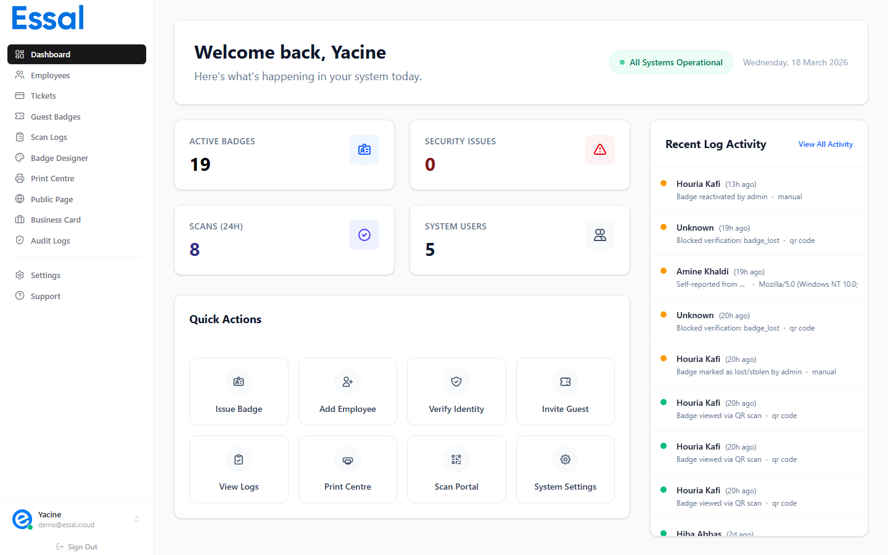

{/* keywords: login, sign in, dashboard, navigation, sidebar, quick stats, recent activity, password, magic link */}
{/* category: Getting Started */}
{/* audience: Admins, Managers, Security */}

This article explains how to sign in to Essal Access and how to read the admin dashboard once you're in.

---

## Signing In

Navigate to [https://access.essal.cloud](https://access.essal.cloud) in any modern browser. You will land on the login page.

Essal Access supports two ways to sign in:

### Option 1 — Magic link (default)

1. Enter your email address and click **Continue**
2. Check your inbox for a sign-in email from Essal Access
3. Click the link in the email — you are signed in immediately, no password needed

Magic links expire after 10 minutes. If the link has expired, return to the login page and request a new one.

### Option 2 — Password login

1. Enter your email address
2. Click **Login with password (Admins)** below the email field to reveal the password input
3. Enter your password and click **Sign in**

> If you have forgotten your password, click **Forgot password?** below the form. A reset link will be sent to your email.

---

## The Admin Dashboard

After signing in, you land on the **Dashboard** — the home screen of the admin panel.

The dashboard is divided into four sections:

### 1. Status bar (top)

The bar across the top of the page shows:

| Element                           | What it tells you                                               |
| --------------------------------- | --------------------------------------------------------------- |
| **Welcome greeting**              | Your name and the current date                                  |
| **All Systems Operational** badge | Links to `status.essal.cloud` — green means no active incidents |

### 2. Metric cards

Four cards give you an at-a-glance view of your tenant:

| Card                | What it counts                                                       |
| ------------------- | -------------------------------------------------------------------- |
| **Active Badges**   | Employees with status **Active**                                     |
| **Security Issues** | Denied and suspicious scans in the last 24 hours                     |
| **Scans (24h)**     | Total badge scans recorded in the last 24 hours                      |
| **System Users**    | Admin, Manager, and Security accounts (excludes Employee-role users) |

### 3. Quick actions

Eight shortcut buttons let you jump to the most common tasks without using the sidebar:

- **Issue Badge** → Print Center
- **Add Employee** → Employees list
- **Verify Identity** → Employees list (for manual verification)
- **Invite Guest** → Guest Badges
- **View Logs** → Audit Logs
- **Print Center** → Print Center
- **Scan Portal** → Opens `scan.access.essal.cloud` in a new tab
- **Settings** → Settings panel

### 4. Recent activity feed

The right-hand column shows a live feed of the last 15 badge scan events. Each entry displays:

- Employee name and how long ago the scan occurred
- Scan result: **green dot** = granted, **red dot** = denied, **amber dot** = suspicious
- Scan reason or denial message, and the authentication method used

Click **View all** at the top of the feed to open the full Audit Logs page.

---

## Sidebar Navigation

The sidebar on the left gives you access to every section of the admin panel. Which items appear depends on your role.

| Nav item                 | Where it goes                       | Who sees it              |
| ------------------------ | ----------------------------------- | ------------------------ |
| **Dashboard**            | Overview screen                     | Admin, Manager, Security |
| **Employees**            | Employee records list               | Admin, Manager, Security |
| **Tickets**              | Access and event tickets            | Admin, Manager           |
| **Guest Badges**         | Temporary visitor badges            | Admin, Manager, Security |
| **Scan Logs**            | Real-time scan records              | Admin, Manager, Security |
| **Badge Designer**       | Visual badge template editor        | Admin, Manager           |
| **Print Center**         | Bulk and single badge printing      | Admin, Manager           |
| **Public Page Editor**   | Configure public profile appearance | Admin, Manager           |
| **Business Card Editor** | Configure digital business card     | Admin, Manager           |
| **Audit Logs**           | Full admin activity log             | Admin, Manager, Security |
| **Settings**             | All configuration options           | Admin, Manager           |
| **Support**              | Opens the support assistant         | All roles                |

Below the navigation items, the sidebar footer shows your **name, email, and role**. Click it to open your profile settings, or click the **Sign out** button to log out.

---

## Security alerts

If Essal Access detects suspicious PIN activity in the last hour (multiple failed PIN attempts), a **red alert banner** will appear at the top of the dashboard above the metric cards. Click **View logs** on the banner to investigate in the Audit Logs, or dismiss it using the × button.
