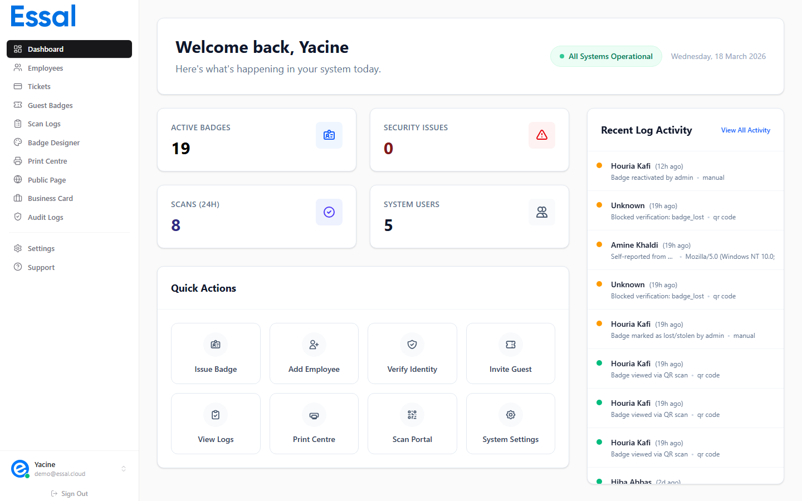

{/* keywords: roles, permissions, admin, manager, security, employee, access control, system users, user management */}
{/* category: Getting Started */}
{/* audience: Admins */}

Essal Access has four system user roles — **Admin**, **Manager**, **Security**, and **Employee**. Each role controls which pages a user can visit and which actions they can take inside the admin panel. This article explains what each role can do and how to decide which role to assign.

---

## The Four Roles at a Glance

| Capability                            | Admin | Manager | Security | Employee |
| ------------------------------------- | :---: | :-----: | :------: | :------: |
| Dashboard                             |  ✅   |   ✅    |    ✅    |    —     |
| View employee list                    |  ✅   |   ✅    |    ✅    |    —     |
| Add / edit employees                  |  ✅   |   ✅    |    —     |    —     |
| Delete employees                      |  ✅   |    —    |    —     |    —     |
| Import employees (CSV)                |  ✅   |   ✅    |    —     |    —     |
| Badge Designer                        |  ✅   |   ✅    |    —     |    —     |
| Print / bulk print badges             |  ✅   |   ✅    |    —     |    —     |
| Guest Badges                          |  ✅   |   ✅    |    ✅    |    —     |
| Tickets                               |  ✅   |   ✅    |    —     |    —     |
| Scan Logs                             |  ✅   |   ✅    |    ✅    |    —     |
| Audit Logs                            |  ✅   |   ✅    |    ✅    |    —     |
| Settings                              |  ✅   |   ✅    |    —     |    —     |
| System Users                          |  ✅   |   ✅    |    —     |    —     |
| Public Page Editor                    |  ✅   |   ✅    |    —     |    —     |
| Business Card Editor                  |  ✅   |   ✅    |    —     |    —     |
| Invite / suspend / delete other users |  ✅   |    —    |    —     |    —     |
| Employee Portal access                |   —   |    —    |    —     |    ✅    |

> **Employee** role users do not have access to the admin panel at all. They log in through the Employee Portal at `portal.access.essal.cloud`.

---

## Admin

**Full access.** Admins can do everything in the system — there are no restrictions on any page or action.

Only Admins can:

- **Delete employee records** permanently
- **Invite, suspend, and delete other system users** — including other Admins
- **View raw user-agent strings** in the Audit Log detail panel

Assign the Admin role to IT managers, HR administrators, or whoever is responsible for managing the Essal Access system itself. Keep the number of Admin accounts small.

> An Admin cannot modify their own account from the System Users panel — this is a safety guard to prevent accidental self-lockout. To change your own password or profile, use the profile menu in the top-right corner.

---

## Manager

**Broad access, no destructive actions.** Managers can access almost everything — employees, badges, settings, tickets, guest badges, audit logs — but they cannot delete employees or manage other system user accounts.

Use the Manager role for:

- **HR staff** who need to add and edit employees but should not be able to permanently delete records
- **Office managers** who handle badge printing and guest badge issuance
- **Department heads** who need to view and export employee data

The key difference from Admin: a Manager sees the full admin panel but the **delete employee**, **invite user**, **suspend user**, and **delete user** actions are not available to them.

---

## Security

**Read-only, operational access.** Security guards and reception staff need to verify badges and review recent scan activity — they do not need to manage employee data or configure the system.

Security users can access:

- **Dashboard** — live overview of recent scan activity and alerts
- **Employees** — view the list and search for an employee (read-only; no add, edit, or delete)
- **Guest Badges** — view and verify guest badge status
- **Scan Logs** — review the full history of badge scans
- **Audit Logs** — review system activity

Security users **cannot** access: Badge Designer, Print Center, Tickets, Settings, System Users, Public Page Editor, or Business Card Editor.

Use this role for frontline security staff, receptionists, and gate operators.

---

## Employee

**Portal-only access.** Employee-role users do not see the admin panel at all. When they sign in, they are redirected to the **Employee Portal** — a separate interface where they can:

- View and display their own badge and QR code
- View their profile, role, department, and employment details
- Update their own information (name, photo, contact info) if their admin has enabled self-editing
- Report a lost or stolen badge
- View their digital business card

The Employee role is typically assigned automatically when a system user account is linked to an employee record. It is not commonly set manually — most staff who need administrative access should get Manager or Security instead.

**Full guide**: Employee Portal Overview

---

## Linking a System User to an Employee Record

A system user account can be **linked to an employee record**, which connects their admin login identity to their badge and profile. This is useful when a manager or HR staff member is also an employee with a badge.

When a user account is linked:

- The Employee Portal is available to them in addition to the admin panel (if their role is Admin, Manager, or Security)
- Their name, photo, and department shown in the top-right profile menu pulls from the employee record
- Their badge QR code works at check-in devices

To link an account, open **System Users**, find or create the user, and select the matching employee record from the **Linked Employee** field in the user form.

---

## Decision Guide — Which Role to Assign?

| Scenario                                            | Recommended role                    |
| --------------------------------------------------- | ----------------------------------- |
| IT administrator / system owner                     | Admin                               |
| HR manager who adds and edits employees             | Manager                             |
| Office manager who prints badges and manages guests | Manager                             |
| Department head who needs read access to reports    | Manager                             |
| Security guard at an entrance                       | Security                            |
| Receptionist who checks guest badges                | Security                            |
| Regular employee who only needs their own badge     | Employee                            |
| Employee who is also an office manager              | Manager (linked to employee record) |

When in doubt, start with the most **restrictive** role that still lets the person do their job. Roles can be changed at any time by an Admin.
