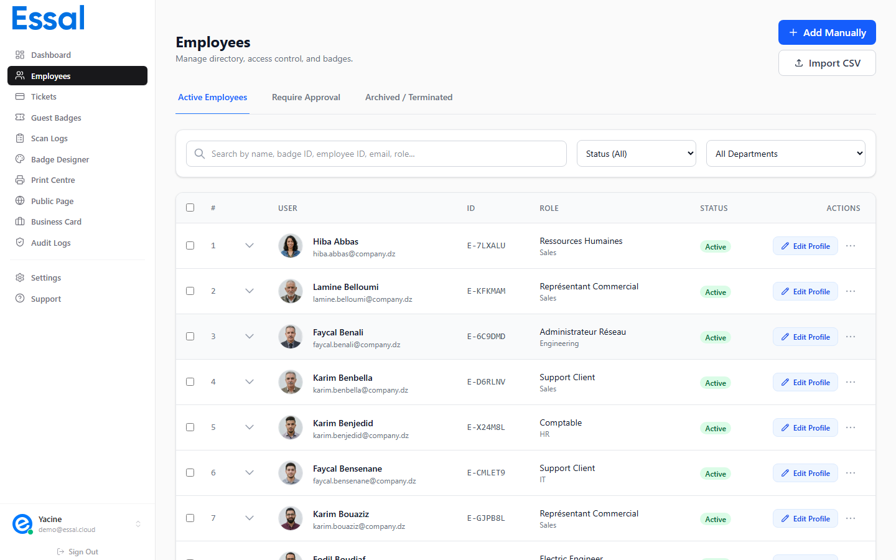

{/* keywords: add employee, new employee, create employee, employee form, employee record, profile, department, photo */}
{/* category: Employee Management */}
{/* audience: Admins, Managers */}

This article walks through adding a single employee record manually. For adding many employees at once, see Importing Employees from CSV.

Navigate to **Employees** in the sidebar, then click **Add Employee** in the top-right corner.

The employee modal opens on the **Profile** tab, ready to fill in.

---

## Required Fields

Only two fields are required to save an employee record:

- **First Name**
- **Last Name**

Everything else is optional — you can fill in additional details now or come back later to edit the record.

---

## Profile Tab — Field Reference

The Profile tab is divided into two sections: **Personal Information** and **Organizational Details**.

### Personal Information

| Field                  | Notes                                                                                                  |
| ---------------------- | ------------------------------------------------------------------------------------------------------ |
| **First Name**         | Required                                                                                               |
| **Last Name**          | Required                                                                                               |
| **Employee ID**        | Auto-generated (e.g. `EMP-A3F7K2`). Editable only when creating a new record — read-only after saving. |
| **Email**              | Work email address. Used for portal login and notifications.                                           |
| **Phone**              | Work or mobile phone number                                                                            |
| **Date of Birth**      | Optional — not shown on the badge by default                                                           |
| **Blood Type**         | Optional — A+, A−, B+, B−, AB+, AB−, O+, O−. Can appear on the badge if enabled in the designer.       |
| **Address**            | Street address                                                                                         |
| **City / State / ZIP** | Location fields                                                                                        |
| **Nationality**        | Optional                                                                                               |
| **Bio**                | Free-text bio — shown on public profiles and the Employee Portal if enabled                            |

### Organizational Details

| Field          | Notes                                                                                                                                                            |
| -------------- | ---------------------------------------------------------------------------------------------------------------------------------------------------------------- |
| **Job Role**   | The person's title or position (e.g. _Security Officer_, _HR Manager_). Shown on the badge if enabled.                                                           |
| **Department** | Select from departments defined in Settings. Departments must exist before they can be selected here — see Managing Departments. |

### Custom Fields

If your admin has defined custom attribute fields (Settings → Custom Fields), they appear below the standard fields. Fields marked with a red asterisk are required.

---

## Adding a Photo

The profile photo appears on the employee's badge and public profile. Three methods are available:

**Upload from file** — Click the photo circle or the **Upload Photo** button. Supported formats: any image file. Maximum size: **2 MB**. The photo is cropped to a circle on the badge.

**Capture from webcam** — Click **Take Photo** to open the camera. Review the captured image, then click **Accept** to use it or **Retake** to try again.

**No photo** — If no photo is uploaded, a placeholder avatar is shown on the badge. You can add a photo later by editing the employee record.

> **AI photo enhancement** (Claid integration): If your tenant has the Claid photo API configured, the background is automatically removed from uploaded photos.

---

## Saving the Record

Click **Save** in the bottom-right of the modal (or press **Alt+S**). The employee is added to the list with status **Active**, and a badge is generated automatically using your badge template.

If either the First Name or Last Name field is empty, the Save button is disabled.

---

## Employee Tabs After Saving

Once a record is saved, the modal has four tabs:

| Tab                 | What's here                                                                                             |
| ------------------- | ------------------------------------------------------------------------------------------------------- |
| **Profile**         | All the fields above — editable at any time                                                             |
| **Security**        | Badge status, 2FA PIN, access schedule, access zones, authenticated-scanner-only toggle                 |
| **Badges**          | Badge history — issue a new badge, view or revoke previous badges                                       |
| **Health & Safety** | Emergency contact, allergies, medical conditions, disabilities, safety certifications, PPE requirements |

These tabs are covered in their own articles. For now, the defaults (Active status, no PIN, no schedule restrictions) are appropriate for most new employees.

---

## Approval Workflow

When the **employee approval workflow** is enabled on your tenant, newly added employees are placed in a **Pending** status instead of Active. They appear in the **Requires Approval** sub-tab of the Employees list. An Admin or Manager must review and approve them before their badge becomes active and scannable.

If you don't see a Requires Approval tab, the workflow is not enabled on your tenant.

---

## Keyboard Shortcuts

| Shortcut     | Action                                                         |
| ------------ | -------------------------------------------------------------- |
| `Alt + N`    | Open the Add Employee modal from the Employees list            |
| `Alt + S`    | Save the current employee record (inside the modal)            |
| `Ctrl + 1–4` | Switch between Profile, Security, Badges, Health & Safety tabs |
| `Escape`     | Close the modal (prompts if there are unsaved changes)         |
