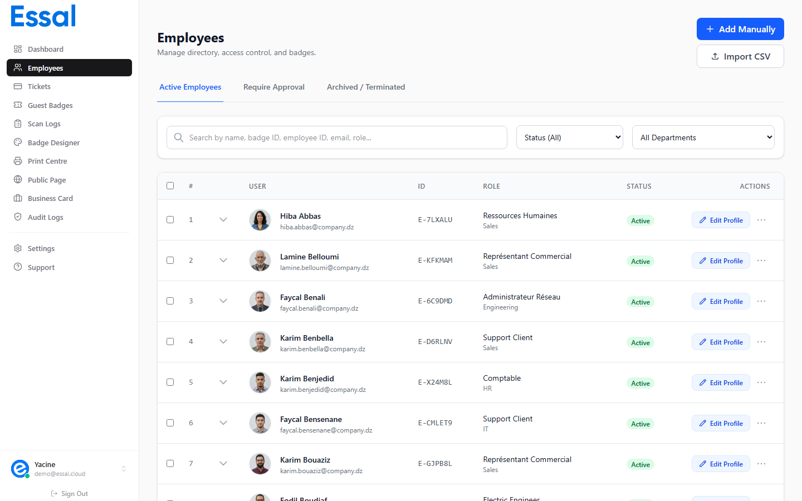
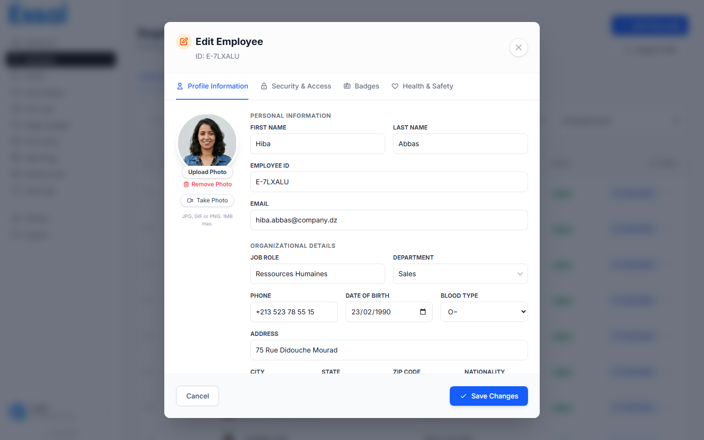

{/* keywords: edit employee, update employee, employee modal, profile tab, security tab, badges tab, health safety tab, modify employee */}
{/* category: Employee Management */}
{/* audience: Admins, Managers */}

This article explains how to open an employee's record and navigate the four tabs available in the employee modal — Profile, Security, Badges, and Health & Safety.

---

## Opening the Employee Modal

Navigate to **Employees** in the sidebar to open the employee list.

Click the **Edit** button (blue, labelled "Edit") on any row to open the employee modal. You can also click the employee's **name** — it opens the same modal on the Profile tab.

The modal header shows:

- **"Edit Employee"** as the title
- The employee's unique ID below the title (e.g. `EMP-A3F7K2`)
- A close (×) button in the top-right corner

> **Unsaved changes**: If you make changes and try to close the modal without saving, a confirmation prompt will appear. Click **Discard** to lose changes or **Keep editing** to stay.

---

## Navigating the Four Tabs

The modal has four tabs along the top. Click a tab to switch, or use the keyboard shortcuts `Ctrl+1` through `Ctrl+4`.

| Tab                 | Shortcut | What's here                                                             |
| ------------------- | -------- | ----------------------------------------------------------------------- |
| **Profile**         | `Ctrl+1` | Personal info, organizational details, photo, custom fields             |
| **Security**        | `Ctrl+2` | Badge status, access zones, 2FA PIN, access schedule, advanced controls |
| **Badges**          | `Ctrl+3` | Full badge history — issue, revoke, or reactivate badges                |
| **Health & Safety** | `Ctrl+4` | Emergency contact, allergies, medical conditions, safety certifications |

---

## Profile Tab

The Profile tab contains all the core employee information. See Adding a New Employee for a full field reference.

Key points when editing:

- **Employee ID** is read-only after the record is first saved — it cannot be changed
- **Department** must already exist in Settings → Departments before it can be selected
- **Custom fields** appear at the bottom of the form if your admin has defined them in Settings → Custom Fields

---

## Security Tab

The Security tab controls how the employee's badge behaves during scanning and what access restrictions apply.

### Badge Status

The **Status** dropdown has three options you can set directly:

| Status            | Effect                                                                   |
| ----------------- | ------------------------------------------------------------------------ |
| **Active**        | Badge is valid; scans are processed normally                             |
| **Suspended**     | Badge is temporarily deactivated; scans are denied                       |
| **Lost / Stolen** | Badge is permanently deactivated immediately; a new badge must be issued |

> **Note**: `Pending` and `Terminated` statuses are set through the employee list actions (Approve, Terminate), not from this dropdown.

### Access Zones

Access zones define which physical areas this employee can enter. When a check-in device is assigned to a zone, it will only grant entry to employees assigned to that zone.

- The **current zones** appear as removable tags — click × to remove one
- Use the **zone dropdown** to add additional zones from the list defined in Settings → Access Zones
- If no zones are assigned, the employee can be scanned at any device (zone restriction is not enforced)
- Click **Manage Access Zones** to open the zone settings page

### Security Controls

| Toggle                                 | What it does                                                                                                                                  |
| -------------------------------------- | --------------------------------------------------------------------------------------------------------------------------------------------- |
| **Require PIN After Scan**             | Employees must enter a 4-digit PIN at the scanner after their QR code is scanned. If enabled with no PIN set, a random PIN is auto-generated. |
| **Public Profile Enabled**             | When on, scanning the badge QR opens the employee's public profile. When off, scans are blocked with an "access disabled" message.            |
| **Allow Badge Use for Access Control** | Enables physical access control integration — the badge can be used to open doors or barriers.                                                |

### 2FA PIN Details

When **Require PIN After Scan** is enabled:

- A 4-digit numeric field appears
- Click **Generate** to create a random PIN automatically
- The PIN is shown in plain text until the record is saved — after saving, only `••••` is displayed with a **Reset** button
- The PIN is stored encrypted; share it with the employee separately

### Time Restricted Access

Enable the **Time Restricted Access** checkbox to restrict when the employee's badge is valid:

- Set **From** and **Until** times using the time pickers
- Toggle individual days using the **Su Mo Tu We Th Fr Sa** buttons (blue = allowed)
- The default when first enabling is Monday through Friday, 09:00–17:00
- Outside the allowed window, scans are denied with an "outside schedule" message

### Advanced Features

Three additional security settings are grouped in an expandable section:

| Setting                                         | When to use                                                                                                                                  |
| ----------------------------------------------- | -------------------------------------------------------------------------------------------------------------------------------------------- |
| **Require approval to issue badge**             | When enabled, the employee moves to `Pending` status and must be manually approved by an Admin or Manager before their badge becomes active. |
| **Show profile only to authenticated scanners** | Restricts profile visibility to registered check-in devices only — useful for executive or sensitive roles.                                  |
| **Require ID with Badge**                       | The check-in app shows a prompt instructing the security guard to verify the employee's physical ID document alongside the badge scan.       |

---

## Badges Tab

The Badges tab shows the complete badge history for this employee — every badge ever issued, its current status, and its issue/deactivation dates.

### Issue New Badge

Click **Issue New Badge** to generate a new badge with a unique Badge ID. This:

1. Creates a new badge entry with status `Active`
2. Deactivates any currently active badge (sets it to `Inactive` with a deactivation timestamp)
3. Updates the employee's `activeBadgeId`

> The **Issue New Badge** button is disabled if the employee already has an active badge, or if the First Name or Last Name fields on the Profile tab are empty.

### Badge List

Each badge in the history shows:

- **Badge ID** — the unique identifier (e.g. `BDG-X7K2M9`)
- **Issued date** — when the badge was created
- **Status** — Active (green), Lost, or Inactive
- **Deactivated date** — shown for inactive/lost badges

### Revoking and Reactivating

- **Revoke** (shown on active badges) — marks the badge as `Lost` and deactivates it. A confirmation prompt appears before the action is applied.
- **Reactivate** (shown on inactive/lost badges) — restores the badge to `Active`. Disabled if another badge is already active or if the employee's name fields are empty.

---

## Health & Safety Tab

The Health & Safety tab stores sensitive employee data for emergency and safety management.

| Section                             | Fields                                                                      |
| ----------------------------------- | --------------------------------------------------------------------------- |
| **Emergency Contact**               | Name, Phone, Relationship                                                   |
| **Allergies**                       | Tag list — type and press Enter or click Add                                |
| **Medical Conditions**              | Tag list — same interaction                                                 |
| **Disabilities / Additional Notes** | Free-text field                                                             |
| **PPE Requirements**                | Tag list for required personal protective equipment                         |
| **Safety Certifications**           | List of certifications with name, cert number, issued date, and expiry date |

### Adding a Safety Certification

1. Click **Add Certification** to reveal the form
2. Enter the certification **Name** (required), **Cert Number** (optional), **Issued Date**, and **Expiry Date**
3. Click **Add Certification** to save it to the list

Certifications with an expiry date are automatically flagged:

- **Expiring Soon** (within 30 days) — amber pill
- **Expired** — red pill

---

## Saving Changes

Click **Save** in the bottom-right corner of the modal, or press `Alt+S`. The button is disabled if either First Name or Last Name is empty.

A spinner appears while the save is processing. After a successful save, the modal remains open so you can continue editing.
