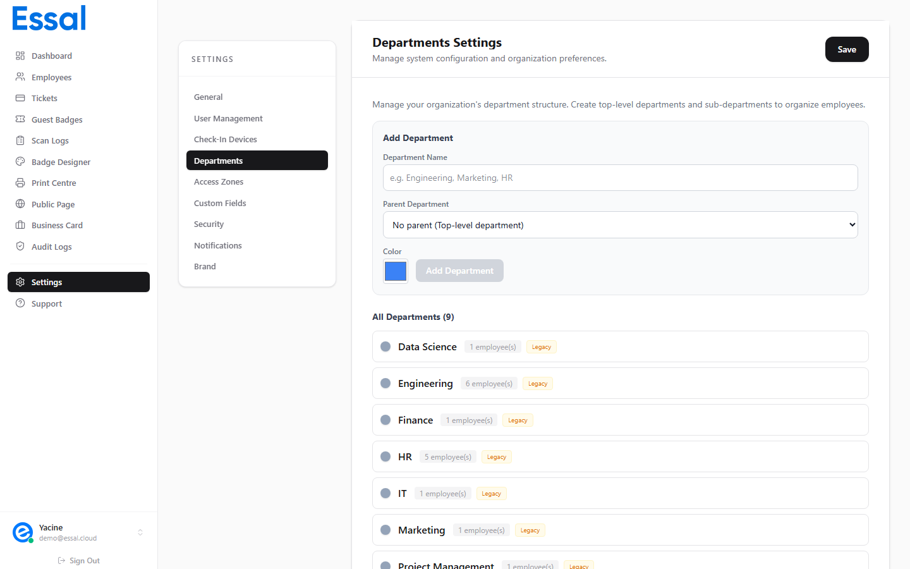

{/* keywords: departments, create department, sub-department, parent department, department hierarchy, color code, department settings */}
{/* category: Employee Management */}
{/* audience: Admins, Managers */}

Departments group employees for filtering, reporting, and badge display. This article explains how to create and manage your department structure in Settings.

Navigate to **Settings** in the sidebar, then click the **Departments** tab.

---

## Creating a Department

1. In the **Departments** tab, find the **New Department** form.
2. Enter the **Department Name** (e.g. _Engineering_, _Human Resources_, _Operations_).
3. Optionally set a **Parent Department** to create a nested structure.
4. Optionally choose a **Color** — used as a visual accent in the employee list and on badges.
5. Click **Add** (or press Enter) to save.

The new department appears immediately in the list and becomes available in the **Department** dropdown on all employee profile forms.

> **At least one department** must exist before you can assign employees to departments when adding or editing records.

---

## Nested Departments (Parent / Child Hierarchy)

You can create sub-departments by setting a **Parent Department**. This lets you model complex org charts. The full path is shown wherever departments appear — e.g., `Operations > Warehouse > Shipping`.

Example hierarchy:

- Operations
  - Logistics
  - Warehouse
    - Receiving
    - Shipping
  - Facilities

**Rules for nesting:**

- A department can have only one parent.
- You can nest departments as deeply as needed.
- A department with sub-departments cannot be deleted until all its sub-departments are removed or re-parented first.

---

## Department Colors

Each department can have a color code. The color is used:

- As a subtle accent on employee list rows.
- On employee badges (if enabled in the template).
- In department filter chips.

Colors have no effect on access control — they are purely visual.

---

## Editing a Department

Click the **Edit** (pencil) icon next to any department in the list to rename it or change its color. The change applies immediately to all employee records assigned to that department.

---

## Deleting a Department

Click the **Delete** (trash) icon next to a department.

**You cannot delete a department if:**

- It has sub-departments — remove or re-parent the sub-departments first.
- Employees are currently assigned to it — reassign those employees to another department first.

> Renaming a department updates all employee records with the new name automatically.

---

## Assigning Employees to Departments

Departments are assigned per employee on the **Profile** tab of the employee modal. Open an employee record, go to the **Profile** tab, and select the department from the **Department** dropdown.

For bulk assignment, use the CSV import wizard — include a `Department` column in your spreadsheet. See Importing Employees from CSV.

---

## Filtering Employees by Department

The **Employees** list has a **Department** filter in the filter bar. Select a department name to show only employees in that department (and sub-departments).
