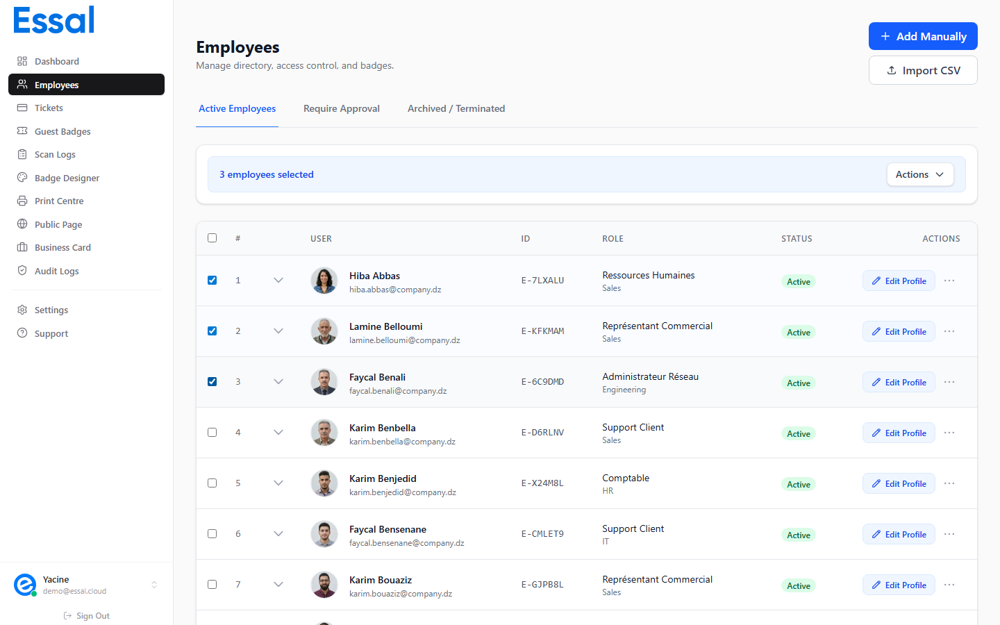

{/* keywords: bulk actions, select multiple employees, batch delete, batch deactivate, batch approve, multi-select, bulk export, CSV export */}
{/* category: Employee Management */}
{/* audience: Admins, Managers */}

Bulk actions let you perform operations on multiple employees at once, saving time compared to acting on each record individually. This article explains how to select employees and what bulk operations are available.

---

## Selecting Employees

Each employee row has a **checkbox** on the far left. Click the checkbox to select that employee. Selected rows are highlighted with a blue tint.

- **Select one** — click a single checkbox
- **Select all on current page** — click the checkbox in the column header
- **Deselect all** — click the header checkbox again, or press `Escape` when no modal is open

The filter bar is replaced by a **"X employees selected"** counter once any checkboxes are checked. Use the search and filter tools first to narrow down the list, then select all visible results.

> Checkboxes and bulk actions are only available to **Admin** and **Manager** roles.

---

## Opening the Batch Actions Menu

With at least one employee selected, a **Batch Actions** dropdown button appears in the selection bar. Click it to see the available operations.

---

## Available Batch Actions

### Export CSV

Downloads a spreadsheet of all selected employees as `employees-export-YYYY-MM-DD.csv`.

**Exported columns**:

- First Name
- Last Name
- Email
- Role
- Department
- Status
- Employee ID

This export includes only the selected employees, not your entire list. Use the filters to select the employees you need before exporting.

---

### Batch Approve

**Visible only on the Require Approval tab.**

Sets all selected `pending` employees to `active` in a single operation. Useful after bulk import when the approval workflow is enabled and you need to activate a batch of new employees at once.

---

### Batch Deactivate

Sets all selected employees to `suspended` status. Skips any employees who are already terminated.

Use this when multiple employees need their access temporarily paused — for example, during a site shutdown or a scheduled audit.

> Suspended employees can be individually reactivated later from their row action menu.

---

### Batch Mark Lost

Marks the active badge of each selected employee as `lost` and updates their status accordingly.

Use this in a security incident where multiple badges are believed to be compromised — for example, if a bag with multiple badge cards was stolen.

Each affected employee will need a badge reissued individually (use **Reissue Badge** from the row action menu).

---

### Batch Delete

**Admin role only.**

Permanently deletes all selected employee records. A confirmation dialog appears before the deletion proceeds.

> **This action cannot be undone.** All data for the deleted employees — badges, tickets, scan history references, and health records — is permanently removed. Use termination (not deletion) if you want to preserve historical records.

---

## Combining Filters with Bulk Actions

For efficient bulk operations:

1. Use the **Search**, **Status**, and **Department** filters to narrow the list to the subset you want to act on
2. Click the **header checkbox** to select all filtered results on the current page
3. Open **Batch Actions** and choose the operation

For example, to export all employees in the Engineering department:

1. Set the Department filter to _Engineering_
2. Click the header checkbox to select all
3. Choose **Export CSV**

---

## Clearing Selection

- Click the **× Deselect** button in the selection bar, or
- Press `Escape` when the employee list is focused and no modal is open
