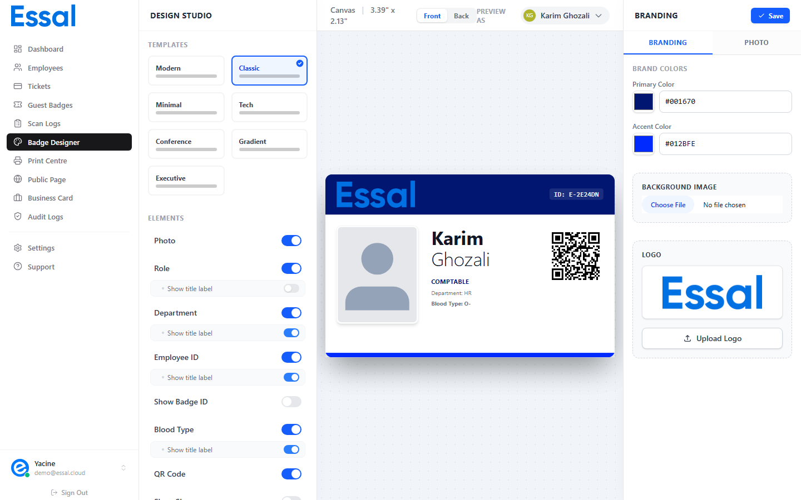

{/* keywords: badge designer, badge template, badge design, badge layout, badge configuration, design badge, template editor */}
{/* category: Badge Design & Templates */}
{/* audience: Admins */}

The Badge Designer is where you create and customize the visual template used for all employee badges. This article explains how the designer works and how to navigate it.

Navigate to **Badge Designer** in the sidebar.

---

## How Badge Templates Work

Essal Access uses a **single shared template** — one design that automatically applies to every employee record using that employee's individual data. When you change the template (colors, layout, displayed fields), every employee's badge updates immediately.

You do not need to design a badge per employee. Design it once, and all badges inherit it.

---

## Navigating the Three-Panel Layout

The designer has three panels side by side:

### Left Panel — Structure & Elements

Controls the badge's overall shape and which fields are displayed:

- **Templates section** — choose from 7 built-in layouts
- **Elements section** — toggle which fields show on the badge front (photo, QR code, name, role, department, etc.)
- **Back Side section** — when the "Back" side is active in the canvas, this panel switches to show the back side controls

### Center Panel — Live Preview Canvas

Shows a real-time rendering of the badge as you configure it:

- Displays the badge at 1.5× scale
- Shows a subtle background pattern
- Includes a **Front / Back** segmented control to switch which side you're viewing and editing
- Includes a **Preview As** employee selector — see the badge with real or mock employee data

### Right Panel — Branding

Two tabs:

- **Branding** — company colors, logo upload, and background image
- **Photo** — AI photo enhancement tools for the selected preview employee

---

## Desktop Only

The Badge Designer is a desktop-only feature. On mobile or tablet screens, a notice is shown instead. Use the designer on a laptop or desktop browser.

---

## Saving Your Design

Changes to the badge template are not saved automatically. When you are happy with your design, click the **Save** button in the top-right of the right panel. A spinner shows while saving. A success notification appears when complete.

> All employee badges update to the new design the moment you save. There is no preview-only or draft mode — saving is live.

---

## The Badge Canvas

The canvas renders an interactive preview of the badge:

- **Hover** over the badge to see a gentle scale-up animation
- The badge dimensions are shown in the toolbar: **3.39" × 2.13"** (standard CR80 card, landscape)
- The background image (if configured) renders as a layer behind the badge content
