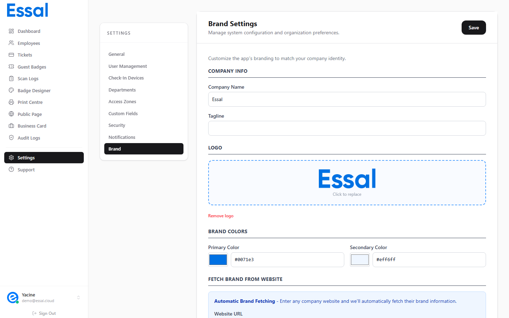

{/* keywords: BrandFetch, brand import, auto logo, brand colors, company logo import, brand fetch, logo URL, primary color import */}
{/* category: Badge Design & Templates */}
{/* audience: Admins */}

BrandFetch lets you automatically import your company's logo and brand colors by entering your website URL — no manual uploading or color picking required. This article explains how to use it.

BrandFetch is located in **Settings** — navigate to **Settings** in the sidebar, then click the **Branding** tab.

---

## How BrandFetch Works

BrandFetch is a brand data service that indexes logos and brand colors for companies worldwide. When you enter your company's website domain, Essal Access queries BrandFetch and pulls back:

- **Company name**
- **Logo** (high-quality image)
- **Primary brand color** (your main brand color)
- **Accent color** (secondary brand color)

These values are applied to your tenant's branding settings and immediately reflected in the Badge Designer.

---

## Importing Your Brand

1. Navigate to **Settings → Branding**
2. Find the **BrandFetch** card
3. Enter your **company website URL** in the input field (e.g. `essal.cloud`)
4. Click **Fetch Brand** (magnifying glass icon)
5. Wait a moment while the data is retrieved

On success:

- Your company name, logo, primary color, and accent color are populated automatically
- A success notice appears confirming the import
- The input clears — the data has been applied

---

## What Gets Updated

After a successful BrandFetch import, the following change in your tenant settings:

| Field             | Where it's used                                                      |
| ----------------- | -------------------------------------------------------------------- |
| **Company Name**  | Badge template, public profiles, email notifications, sidebar header |
| **Logo**          | Badge front and back, public profile pages, Badge Designer           |
| **Primary Color** | Badge Designer primary color, UI accents                             |
| **Accent Color**  | Badge Designer accent color                                          |

All employee badges update to use the new logo and colors the next time the badge template is saved.

> **Note**: BrandFetch imports set the same values you can configure manually. You can always override imported values by editing the fields directly after importing.

---

## BrandFetch is Not Available for All Companies

BrandFetch indexes major companies and many medium-sized businesses, but not every organization. If your company is not found:

- Try entering just the domain (e.g. `company.com` rather than `https://www.company.com`)
- If BrandFetch doesn't have your brand, upload your logo and colors manually in the Badge Designer

---

## Demo Brands

Below the BrandFetch input, a **Demo Brands** selector offers 6 preset brands you can apply instantly to see how the badge looks with a real brand identity. Selecting a demo brand applies its name, logo, and primary color immediately.

Use this to quickly test different badge styles before applying your real brand.

---

## Applying Brand Data to the Badge Designer

After importing via BrandFetch, your logo and colors are stored in Settings. They are automatically loaded into the Badge Designer's right panel when you open it. No additional steps are needed — the badge preview updates to show your brand immediately.

To manually access the same settings in the Badge Designer:

- Logo: **Badge Designer → Branding tab → Logo section**
- Colors: **Badge Designer → Branding tab → Brand Colors section**
