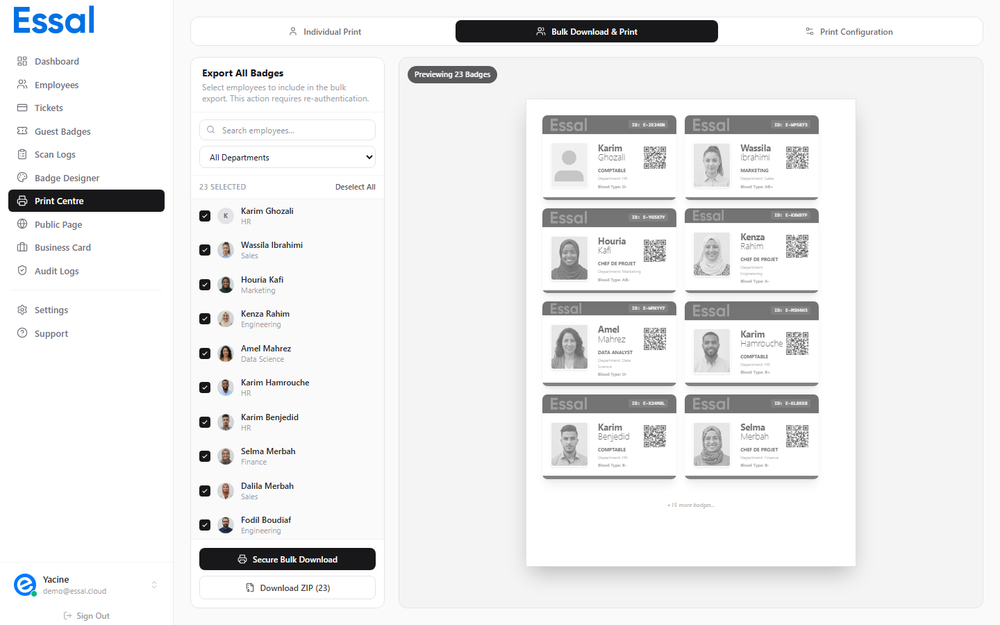

{/* keywords: bulk print, print multiple badges, print all employees, bulk badge print, select employees print, print batch */}
{/* category: Printing & Exporting Badges */}
{/* audience: Admins, Managers */}

The Bulk tab in the Print Center lets you select any number of employees and print all their badges on a single print job — laid out in a grid across one or more pages.

---

## Opening Bulk Print

1. Navigate to **Print Center** in the sidebar (or go to `/print`)
2. Click the **Bulk** tab at the top of the Print Center
3. The left panel shows your employee list with checkboxes; the right panel shows a live page preview

---

## Selecting Employees

**Search and filter** the employee list using:

- **Search box** — filter by first or last name
- **Department dropdown** — show only employees from a specific department

**Selection controls:**

- Check individual employees by clicking their checkbox
- Use **Select All** to select every employee currently visible (after any filters)
- Use **Deselect All** to clear the current selection
- The header shows the count of selected employees (e.g. "12 selected")

The right panel live preview updates as you make selections, showing how the badges will lay out on the page.

---

## Understanding the Page Preview

The right panel shows a scaled-down preview of how your print page will look:

- Badges are arranged in a grid (columns × rows)
- A **"+N more badges"** indicator appears if the selection exceeds one page
- The preview reflects your current **Config** settings (paper size, scale, grid gap, margins)

To adjust how many badges fit per page, go to the **Config** tab and adjust Badge Scale, Grid Gap, and Page Margin.

---

## Printing to the Browser

Click **Secure Download** (or **Print All**) to print the badge sheets:

1. A **Security Verification** dialog appears — click **Authorize** to confirm
2. Your browser's print dialog opens
3. All selected employee badges are rendered across however many pages are needed

**Browser print tips:**

- Set margins to **None** in the browser dialog
- Disable headers and footers
- Enable **Background graphics** so badge colors render correctly
- Use **100% scale** — the layout is pre-calculated

---

## Print Order

Badges are printed in the order they appear in the employee list (alphabetical by default after any filtering). To print specific employees in a specific order, use filters to isolate a group, or use the individual Print action for each employee in sequence.

---

## ZIP Export Instead of Printing

If you need individual PNG files rather than printing directly, click **Download ZIP** instead:

- A security confirmation appears — click **Authorize**
- A progress indicator shows `{done}/{total}` while badges render
- A single `.zip` file downloads when complete, containing one PNG per selected employee

See Exporting Badges as PNG/ZIP for full details.

---

## Back Side Printing

If your badge template has the **back side enabled** (configured in Badge Designer), the print job automatically includes a second set of pages with the badge backs. These are printed on the reverse side of the card stock.
