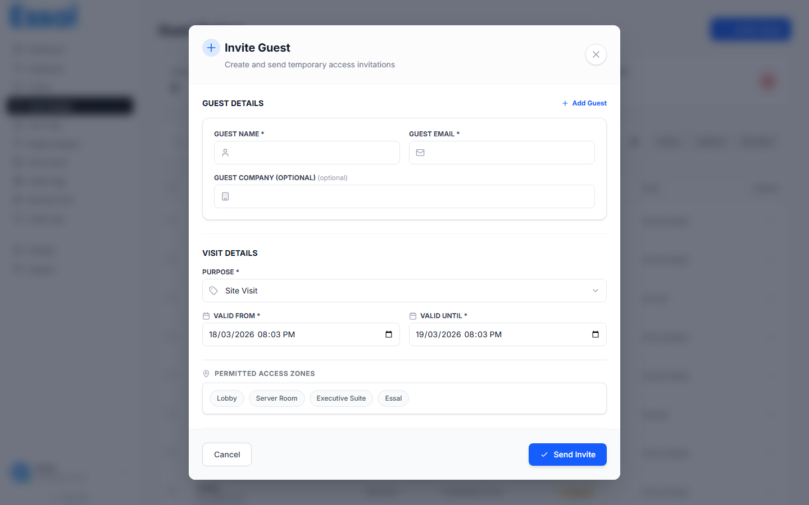

{/* keywords: create guest badge, new visitor pass, guest invite, invite visitor, add guest */}
{/* category: Guest Badges */}
{/* audience: Admins, Managers, Reception */}

This article walks through filling in the Create Guest Badge form and sending the invite.

---

## Opening the Create Modal

1. Navigate to **Guest Badges** in the sidebar
2. Click the **New Guest Badge** (or **+ Add**) button in the top-right corner
3. The **Create Guest Badge** modal opens

---

## Step 1 — Guest Details

Enter the information for the person (or people) you are inviting.

| Field | Required | Notes |
|---|---|---|
| **Name** | ✓ | Full name of the guest |
| **Email** | ✓ | The invite email is sent to this address |
| **Company** | Optional | Displayed on the verification page |

### Inviting Multiple Guests at Once

You can create up to **10 guest badges in a single submission**:

1. Fill in the first guest's details
2. Click **Add Guest** to add another row
3. Repeat up to 10 guests
4. Use the trash icon on any row to remove a guest

Each guest in the list receives their own unique badge link.

---

## Step 2 — Visit Details

Define when the badge is valid and why the guest is visiting.

| Field | Default | Options |
|---|---|---|
| **Purpose** | — | Site Visit, Interview, Meeting, Delivery, Event, Other |
| **Valid From** | Current date/time | Any future or present datetime |
| **Valid Until** | 24 hours from now | Any datetime after Valid From |

> **Tip:** If you select **Other** for Purpose, a free-text field appears so you can enter a custom reason.

---

## Step 3 — Permitted Access Zones (Optional)

If your organization has defined **access zones**, a list of zone chips appears here. Click any zone to toggle it on or off. Only the selected zones will be shown on the guest's verification page.

This section is hidden if no zones have been configured.

---

## Step 4 — Address / Location (Optional)

Add a location entry to help the guest navigate to the right place. This is especially useful for large campuses or multi-building sites.

- **Address Name** — a short label (e.g., "Main Entrance", "Building B Reception")
- **Maps Link** — a direct URL to Google Maps or any mapping service
- Click **Search Google Maps** to open a Maps search in a new tab and copy the link

You can add multiple address entries. The **last-used address is remembered** across sessions — the next time you open the modal, the address fields are pre-filled.

---

## Step 5 — Notes (Optional)

Use the **Notes** field for any additional instructions or context for the guest (e.g., "Please bring a photo ID", "Parking available in Lot C"). Notes are stored in the badge record but are not displayed on the public verification page.

---

## Sending the Invite

Once all required fields are filled:

- **"Send Invite"** — appears when you have entered one guest
- **"Send N Invites"** — appears when you have multiple guests in the list (N = count)

Click the button to:
1. Create badge records in the database for all guests
2. Send each guest an email with their unique badge link
3. Close the modal and refresh the Guest Badges list

### What Happens if an Email Bounces?

If an email address is invalid and the invite bounces, the badge is still created successfully. The guest row will be highlighted in amber to indicate the bounce. You can still copy the badge link manually and share it another way.

