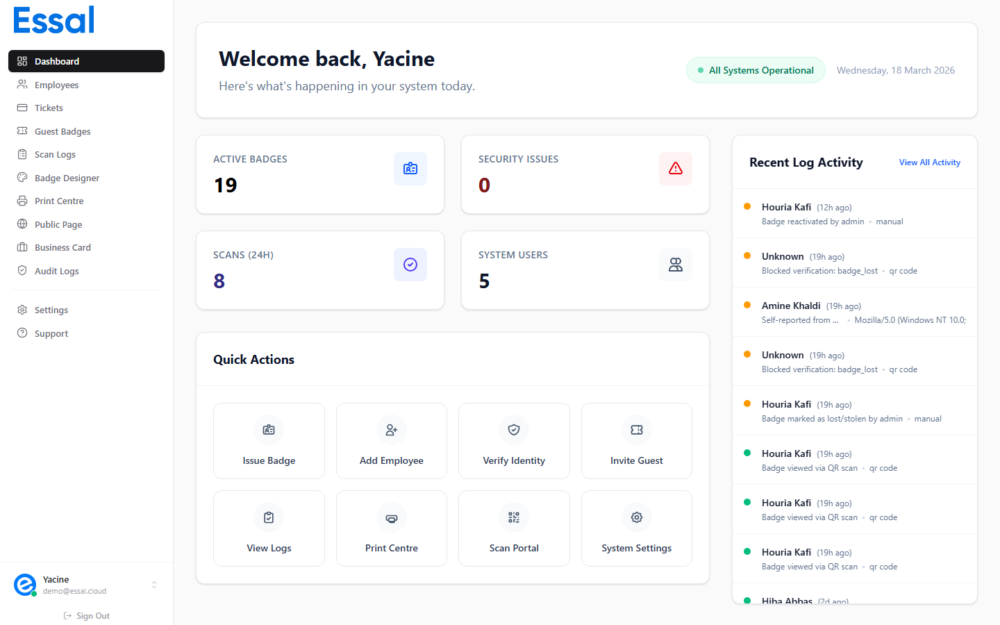

{/* keywords: send setup email, email registration, invite device, checkin invite email */}
{/* category: Check-In Devices */}
{/* audience: Admins, Managers */}

Instead of reading a code aloud or copying it manually, you can send a setup invitation email directly to the person who will be setting up the device. The email includes the registration code and a direct link to the check-in app.

---

## When to Use Email Invitations

Email invitations are useful when:
- The person setting up the device is in a different location
- You want to schedule device setup without being present
- You are sending instructions to a non-technical operator who needs a clear setup link

Unlike codes generated from the **Generate Code** button (which expire after 15 minutes), email invitation codes do **not expire** — they remain valid until used.

---

## Sending the Invitation Email

1. Navigate to **Check-In Devices** in the admin panel
2. Click **Send Setup Email**
3. Fill in the invitation form:
   - **Email address** (required) — the recipient will receive the setup link here
   - **Recipient name** (optional) — personalizes the email greeting
4. Click **Send**

The system generates a unique registration code and sends an email containing:
- Your organization's name and logo (from your whitelabel settings)
- A direct link to **`https://scan.idpage.link`**
- The registration code to enter during setup
- Step-by-step setup instructions

The email is delivered in the language configured in your organization's settings (English, French, or Arabic).

---

## What the Recipient Does

When the recipient receives the email:
1. Open the link to `https://scan.idpage.link` on the device
2. Follow the setup wizard (as described in Registering a New Device)
3. Enter the code from the email when prompted

---

## Bounce Detection

If the recipient's email address is invalid and the email bounces, the admin panel will show an error notification. Check the email address and try again.

---

## Security Note

Each registration code can only be used **once**. After it has been used to register a device, the code is invalidated and cannot be reused. If the code is used by the wrong device by mistake, you can **revoke** the device from the admin panel and generate a new code.
