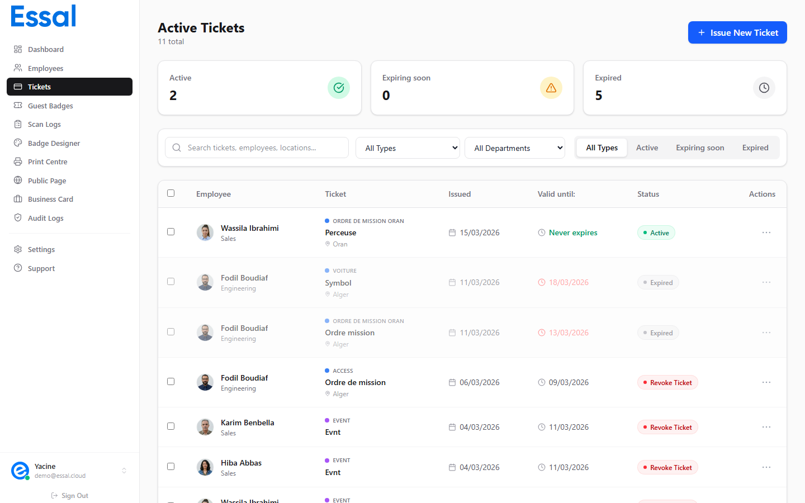

{/* keywords: tickets, employee ticket, access pass, meal voucher, event ticket, ticket types */}
{/* category: Tickets */}
{/* audience: Admins, Managers */}

Tickets are digital passes you can issue to employees for a specific purpose and time period — such as an access pass, meal voucher, parking permit, or event admission. Each ticket generates a unique QR code link that can be scanned to verify its validity.

---

## How Tickets Work

When you issue a ticket to an employee, Essal Access:

1. Creates a ticket record attached to the employee's profile with a unique ID (e.g. `TKT-A1B2C3D4E5`)
2. Generates a public verification link: `https://idpage.link/ticket/{ticketId}`
3. The employee (or an operator) can open or share that link to show the ticket's current status

No separate account or app is needed for the recipient — the link opens a public page showing the ticket details.

---

## Ticket Types

Every ticket belongs to a **ticket type** that defines its name and color. Essal Access comes with six built-in types:

| Type | Color | Typical use |
|---|---|---|
| Access | Blue | Building or area access pass |
| Meal | Green | Cafeteria or meal voucher |
| Event | Purple | Event or conference admission |
| Parking | Amber | Parking permit |
| Transport | Cyan | Transportation pass |
| Voucher | Pink | General-purpose voucher |

You can also create your own custom ticket types with any name and color. See Creating Custom Ticket Types for details.

---

## What Makes Tickets Different from Guest Badges

| | Tickets | Guest Badges |
|---|---|---|
| Issued to | **Employees** (existing records) | **Guests** (no employee account needed) |
| Type system | Fully customizable types | Single type |
| Bulk issue | Yes — entire department at once | No |
| Never-expire option | Yes | No |
| Storage | Attached to the employee's profile | Separate guest record |

---

## Viewing All Tickets

Navigate to **Tickets** in the sidebar to see all issued tickets across your organization. You can filter by ticket type, department, status, and search by employee name, ticket title, or location.
