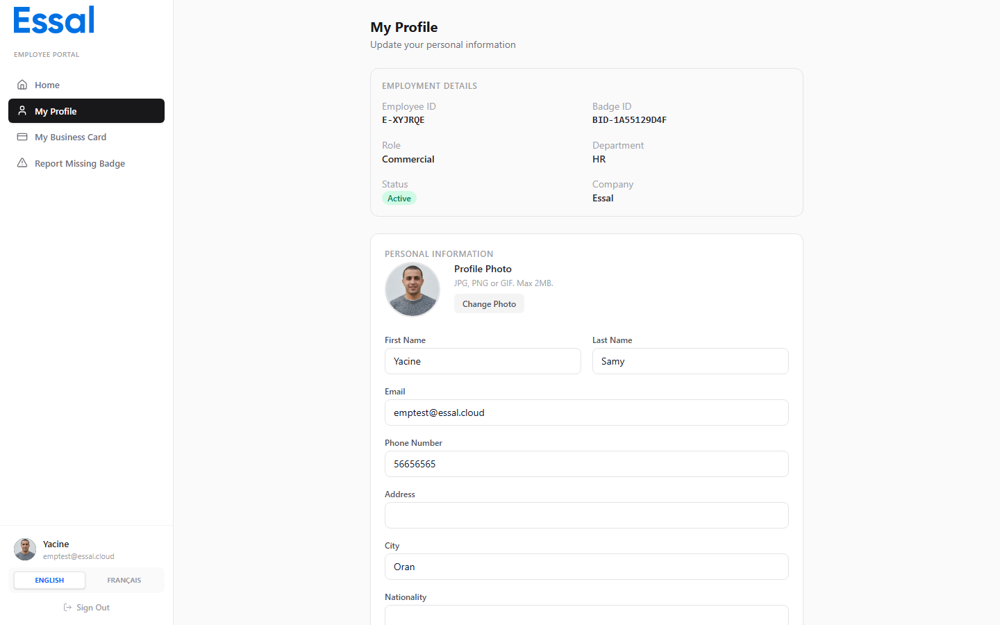

{/* category: Employee Portal */}

Employees can update their personal information, profile photo, and account settings directly from the portal without needing to contact an administrator.

## Updating Personal Information

1. Go to **My Profile** in the sidebar.
2. Edit any of the following fields:
   - First name
   - Last name
   - Email address
   - Phone number
   - Address
   - City
   - Nationality
   - Bio
3. Click **Save Changes**.

> **Note:** Fields such as your Employee ID, Badge ID, department, role, and employment status are controlled by your administrator and cannot be changed from the portal.

## Uploading a Profile Photo

1. On the **My Profile** page, click your profile photo or the upload icon.
2. Select an image file from your device. The file must be **2 MB or smaller**.
3. Your photo is uploaded and updated immediately.

Supported formats include JPEG, PNG, and WebP. If your file is too large, compress it before uploading.

## Custom Attribute Fields

If your organisation uses custom profile attributes, an additional section appears on the profile page. Fields that your administrator has marked as employee-editable can be filled in here. Read-only custom fields display the value without an input control.

## How Changes Are Applied

Depending on your organisation's settings, profile edits may work in one of two ways:

- **Direct update** — your changes are applied to your employee record immediately and are visible everywhere (badge, directory, etc.).
- **Business card override** — your changes are stored separately and appear only on your digital business card and public profile, without modifying the master employee record.

Your administrator controls which mode is active. If you are unsure which applies to you, ask your HR or IT team.

## Updating Account Settings

To change your display name, password, email, or language:

1. Click your name or avatar at the bottom of the sidebar.
2. The **Account Settings** panel opens.
3. On the **Profile** tab you can update your display name and language.
4. On the **Security** tab you can update your email address and set a new password.
5. Click **Save** to apply changes.
