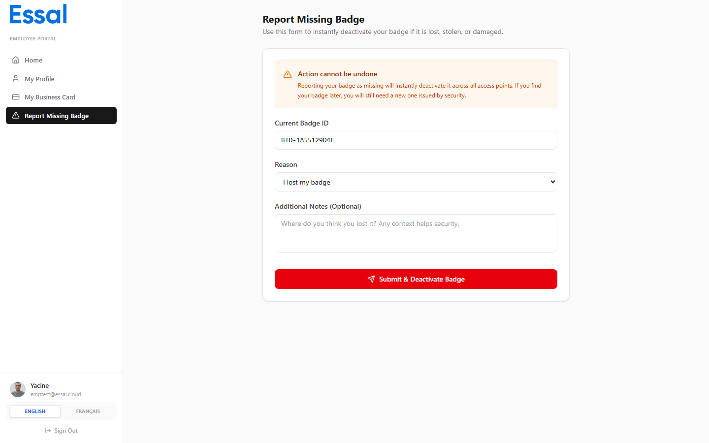

{/* category: Employee Portal */}

If your badge has been lost, stolen, or damaged, report it immediately through the portal. This deactivates the badge and flags your record so your administrator can issue a replacement.

## How to Submit a Report

1. Click **Report Missing Badge** in the sidebar.
2. Your current **Badge ID** is shown at the top (read-only).
3. Select the reason from the dropdown:
   - **Lost** — you cannot locate your badge
   - **Stolen** — your badge was taken without your consent
   - **Damaged** — your badge is physically damaged and unusable
4. Optionally, add any relevant notes in the **Notes** field.
5. Click **Submit**.

## What Happens After You Submit

- Your badge status is set to **Lost** and can no longer be used for check-in.
- Your employee status is updated to reflect the missing badge.
- The event is recorded in the audit log with a timestamp.
- Your administrator is able to see the report and issue a replacement badge.

## After Reporting

Once you submit the report, the page shows a confirmation message. You cannot reverse the report yourself — contact your HR or IT administrator to have a new badge assigned or to resolve the report if it was submitted in error.

## If the Form Does Not Appear

If you see a confirmation screen when you open the Report Missing Badge page instead of a form, your badge has already been reported as lost or is not currently active. Contact your administrator for assistance.
