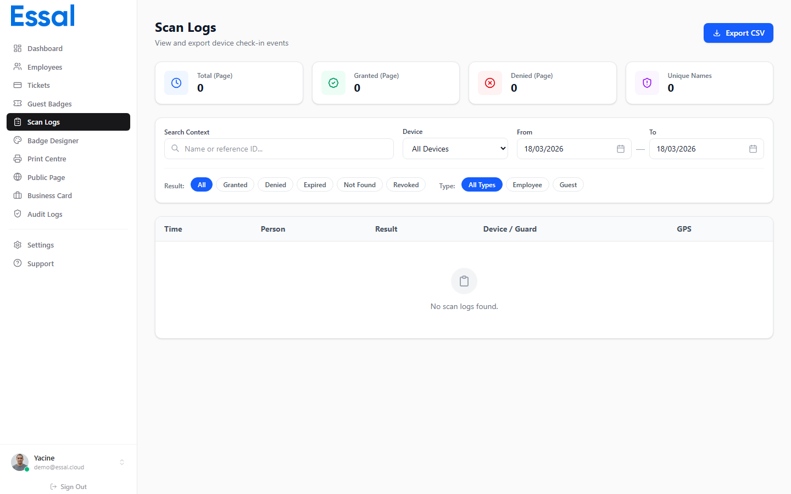

{/* category: Public Profiles & QR Scanning */}

Essal Access maintains two separate scan log systems: **Audit Logs** for public badge scans and **Scan Logs** for check-in device scans. Both are available in the admin panel.

## Audit Logs (Public Badge Scans)

**Location:** Admin panel → **Audit Logs** (route: `/audit-logs`)

Audit logs record every interaction with a public badge profile — whether the scan succeeded, was blocked, or triggered a security alert.

### What Is Recorded

Each audit log entry captures:

| Field | Description |
|---|---|
| **Employee** | Name of the employee whose badge was scanned |
| **Badge ID** | The physical badge ID used |
| **Status** | Outcome of the scan (see below) |
| **Reason** | Human-readable description of the outcome |
| **Timestamp** | Date and time of the scan |
| **Device** | Browser and operating system of the scanner |
| **Device type** | Desktop, mobile, or tablet |
| **IP address** | Resolved automatically after the scan |
| **Auth method** | How the scan was initiated (QR code, PIN, etc.) |

### Status Values

| Status | Meaning |
|---|---|
| `success` | Profile viewed — badge and employee are active |
| `denied` | Scan blocked (invalid badge, profile disabled, etc.) |
| `badge_lost` | Badge was reported lost or stolen |
| `badge_suspended` | Badge or employee is suspended |
| `badge_terminated` | Employee has been terminated |
| `suspicious` | Unusual activity detected (e.g. badge deactivated mid-session) |

### IP Address Resolution

The IP address is resolved asynchronously in the background after the scan event is created. There is a brief window where the IP may show as empty while the lookup completes.

---

## Scan Logs (Check-In Device Scans)

**Location:** Admin panel → **Scan Logs** (route: `/scan-logs`)

Scan logs record every scan performed by a registered check-in device — such as a tablet running the Essal Check-In App.

### What Is Recorded

Each scan log entry captures:

- Employee name and badge ID
- Scan result (Access Granted / Denied)
- The check-in device that performed the scan
- Location of the device
- Timestamp

### Difference from Audit Logs

| | Audit Logs | Scan Logs |
|---|---|---|
| **Source** | Any QR scan (phone, browser, etc.) | Registered check-in devices only |
| **Authentication** | None required | Device must be registered |
| **Primary use** | Security monitoring, profile access tracking | Physical access control at entry points |

Use both logs together for a complete picture of badge activity across your organization.
