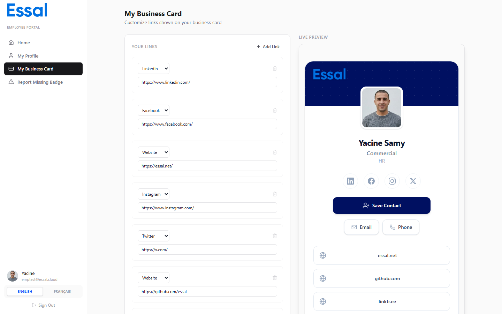

{/* category: Business Cards */}

Links on a business card can be added by both administrators (for all employees) and by employees themselves (personal links). This article covers both.

## Links Added by Administrators

Administrators can add links that appear on every employee's business card via the **Business Card Editor** (Settings → Business Card Editor). These are organization-wide links — the same links appear regardless of which employee's card is viewed.

See Configuring the Business Card Template for instructions.

## Links Added by Employees (via the Portal)

Employees can add their own personal links through the **My Business Card** page in the Employee Portal.

### How to Add a Link

1. Log in to the Employee Portal and go to **My Business Card**.
2. In the links panel on the left, choose a **Type**:

   | Type | Display style |
   |---|---|
   | **Website** | Pill button with globe icon |
   | **LinkedIn** | Circle icon in LinkedIn blue |
   | **Twitter / X** | Circle icon in black |
   | **Instagram** | Circle icon in pink |
   | **Facebook** | Circle icon in Facebook blue |
   | **Custom** | Pill button with a label you define |

3. Enter the full URL (e.g. `https://linkedin.com/in/yourname`).
4. For **Custom** type, enter a label (e.g. "Portfolio" or "Book a Meeting").
5. Click **Add**.

The preview on the right updates immediately so you can see how the link will look.

### Removing a Link

Click the × button next to any link in the list to remove it.

### Saving

Click **Save** to store your links. Changes are not applied until you save.

## How Links Are Displayed on the Card

**Social links** (LinkedIn, Twitter, Instagram, Facebook) are shown as small circular icon buttons in the social media section, below the employee's name and role.

**Website and custom links** are shown as full-width pill buttons below the contact shortcuts.

## Social Media Brand Colors

| Platform | Color |
|---|---|
| LinkedIn | `#0077b5` |
| Twitter / X | `#000000` |
| Instagram | `#e4405f` |
| Facebook | `#1877f2` |
