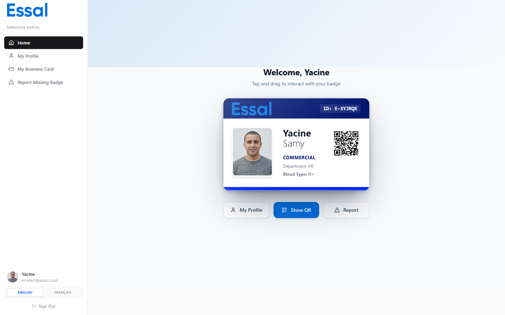

{/* category: Business Cards */}

An employee's digital business card can be shared in several ways: via a direct link, a QR code, or a downloadable vCard file. No app or account is required for the recipient.



## Sharing via Link

Every employee has a public URL based on their badge ID:

```
https://{your-company-domain}/{badgeId}
```

Copy this link and share it by email, messaging app, or any other channel. When the recipient opens it, they see your business card directly — no login required.

You can find your badge ID on the **My Profile** page in the Employee Portal, in the **Badge ID** field.

## Sharing via QR Code

Your badge's QR code links directly to your business card (or full public profile, depending on your organization's settings).

**To show your QR code:**

1. Log in to the Employee Portal.
2. Go to **Home**.
3. Click **Show QR Code**.
4. A full-screen QR code appears — let the other person scan it with their phone.

**Physical badges** also contain a QR code. Scanning the printed badge with any phone camera opens the public page automatically.

## Saving a Contact (vCard)

The **Save Contact** button on the business card generates a vCard (`.vcf`) file and downloads it to the visitor's device. The vCard includes:

- Full name and job title
- Organization / department
- Phone number and email address
- Address (if location is shown)
- Website and custom links
- Social media profile links

Most phones and email clients can import `.vcf` files directly into their contacts app.

## What the Recipient Sees

The recipient opens a mobile-friendly page showing:

- Your cover with company branding
- Your photo, name, role, and department
- Social media icon links
- Save Contact and quick-action buttons (Email, Call)
- Website and custom links
- Bio and contact details

No account, app, or login is required on the recipient's side.
