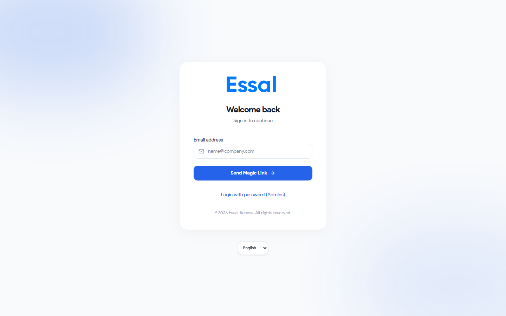

{/* keywords: connexion, se connecter, tableau de bord, navigation, barre latérale, statistiques rapides, activité récente, mot de passe, lien magique */}
{/* category: Getting Started */}
{/* audience: Admins, Managers, Security */}

Cet article explique comment se connecter à Essal Access et comment lire le tableau de bord d'administration une fois connecté.

---

## Se connecter

Accédez à [https://access.essal.cloud](https://access.essal.cloud) dans n'importe quel navigateur moderne. Vous arriverez sur la page de connexion.

Essal Access propose deux façons de se connecter :

### Option 1 — Lien magique (par défaut)

1. Saisissez votre adresse e-mail et cliquez sur **Continuer**
2. Consultez votre boîte de réception pour un e-mail de connexion envoyé par Essal Access
3. Cliquez sur le lien dans l'e-mail — vous êtes connecté immédiatement, sans mot de passe

Les liens magiques expirent après 10 minutes. Si le lien a expiré, retournez sur la page de connexion et demandez-en un nouveau.

### Option 2 — Connexion par mot de passe

1. Saisissez votre adresse e-mail
2. Cliquez sur **Se connecter avec un mot de passe (Admins)** sous le champ e-mail pour afficher le champ de mot de passe
3. Saisissez votre mot de passe et cliquez sur **Se connecter**

> Si vous avez oublié votre mot de passe, cliquez sur **Mot de passe oublié ?** sous le formulaire. Un lien de réinitialisation sera envoyé à votre adresse e-mail.

---

## Le tableau de bord d'administration

Après la connexion, vous arrivez sur le **Tableau de bord** — l'écran d'accueil du panneau d'administration.

Le tableau de bord est divisé en quatre sections :

### 1. Barre de statut (en haut)

La barre en haut de la page affiche :

| Élément                                   | Ce qu'elle indique                                                  |
| ----------------------------------------- | ------------------------------------------------------------------- |
| **Message de bienvenue**                  | Votre nom et la date du jour                                        |
| **Badge Tous les systèmes opérationnels** | Lien vers `status.essal.cloud` — vert signifie aucun incident actif |

### 2. Cartes de métriques

Quatre cartes vous donnent un aperçu rapide de votre locataire :

| Carte                     | Ce qu'elle compte                                                            |
| ------------------------- | ---------------------------------------------------------------------------- |
| **Badges actifs**         | Employés avec le statut **Actif**                                            |
| **Problèmes de sécurité** | Scans refusés et suspects au cours des 24 dernières heures                   |
| **Scans (24h)**           | Total des scans de badges enregistrés au cours des 24 dernières heures       |
| **Utilisateurs système**  | Comptes Admin, Manager et Sécurité (exclut les utilisateurs de rôle Employé) |

### 3. Actions rapides

Huit boutons de raccourci vous permettent d'accéder aux tâches les plus courantes sans utiliser la barre latérale :

- **Émettre un badge** → Centre d'impression
- **Ajouter un employé** → Liste des employés
- **Vérifier l'identité** → Liste des employés (pour la vérification manuelle)
- **Inviter un visiteur** → Badges visiteurs
- **Voir les journaux** → Journaux d'audit
- **Centre d'impression** → Centre d'impression
- **Portail de scan** → Ouvre `scan.access.essal.cloud` dans un nouvel onglet
- **Paramètres** → Panneau de paramètres

### 4. Fil d'activité récente

La colonne de droite affiche un fil en direct des 15 derniers événements de scan de badges. Chaque entrée affiche :

- Le nom de l'employé et depuis combien de temps le scan a eu lieu
- Le résultat du scan : **point vert** = accordé, **point rouge** = refusé, **point ambré** = suspect
- La raison du scan ou le message de refus, et la méthode d'authentification utilisée

Cliquez sur **Voir tout** en haut du fil pour ouvrir la page complète des journaux d'audit.

---

## Navigation dans la barre latérale

La barre latérale sur la gauche vous donne accès à toutes les sections du panneau d'administration. Les éléments affichés dépendent de votre rôle.

| Élément de navigation          | Destination                                   | Qui le voit              |
| ------------------------------ | --------------------------------------------- | ------------------------ |
| **Tableau de bord**            | Écran de vue d'ensemble                       | Admin, Manager, Sécurité |
| **Employés**                   | Liste des enregistrements d'employés          | Admin, Manager, Sécurité |
| **Tickets**                    | Tickets d'accès et d'événements               | Admin, Manager           |
| **Badges visiteurs**           | Badges temporaires pour visiteurs             | Admin, Manager, Sécurité |
| **Journaux de scan**           | Enregistrements de scan en temps réel         | Admin, Manager, Sécurité |
| **Badge Designer**             | Éditeur visuel de modèles de badges           | Admin, Manager           |
| **Centre d'impression**        | Impression de badges en masse et individuelle | Admin, Manager           |
| **Éditeur de page publique**   | Configurer l'apparence du profil public       | Admin, Manager           |
| **Éditeur de carte de visite** | Configurer la carte de visite numérique       | Admin, Manager           |
| **Journaux d'audit**           | Journal complet d'activité admin              | Admin, Manager, Sécurité |
| **Paramètres**                 | Toutes les options de configuration           | Admin, Manager           |
| **Support**                    | Ouvre l'assistant de support                  | Tous les rôles           |

Sous les éléments de navigation, le pied de page de la barre latérale affiche votre **nom, adresse e-mail et rôle**. Cliquez dessus pour ouvrir vos paramètres de profil, ou cliquez sur le bouton **Se déconnecter** pour vous déconnecter.

---

## Alertes de sécurité

Si Essal Access détecte une activité suspecte sur le PIN au cours de la dernière heure (tentatives de PIN échouées multiples), une **bannière d'alerte rouge** apparaîtra en haut du tableau de bord au-dessus des cartes de métriques. Cliquez sur **Voir les journaux** sur la bannière pour enquêter dans les journaux d'audit, ou ignorez-la en utilisant le bouton ×.
