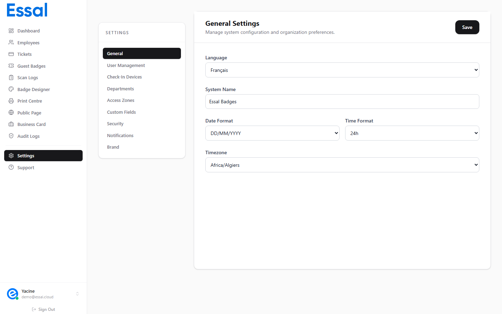

{/* keywords: paramètres, langue, fuseau horaire, format de date, format d'heure, nom du système, paramètres généraux, localisation */}
{/* category: Getting Started */}
{/* audience: Admins */}

Cet article décrit l'onglet **Paramètres → Général** — où vous configurez la langue du système, l'affichage des dates et heures, le fuseau horaire et le nom du système qui apparaît dans toute l'interface.

Accédez à **Paramètres** dans la barre latérale, puis assurez-vous que l'onglet **Général** est sélectionné (c'est le défaut).

---

## Langue

Le menu déroulant **Langue** définit la langue de l'interface pour tous les utilisateurs du panneau d'administration dans votre locataire.

| Option       | Valeur |
| ------------ | ------ |
| English (US) | `en`   |
| Français     | `fr`   |

Changer la langue affecte tous les textes de l'interface, les libellés et les noms de boutons dans le panneau d'administration, l'Employee Portal et l'application de pointage. Cela n'affecte pas le contenu des enregistrements d'employés ni le texte des articles.

> **Remarque** : La sélection de langue s'applique à l'ensemble du locataire — tous les utilisateurs de votre organisation verront la même langue d'interface. Les utilisateurs individuels ne peuvent pas remplacer ce paramètre depuis leur propre profil.

---

## Nom du système

Le champ **Nom du système** définit une étiquette personnalisée pour votre instance d'Essal Access. Ce nom apparaît dans :

- Le titre de l'onglet du navigateur
- Le haut de la barre latérale
- Les notifications par e-mail envoyées aux employés

La plupart des organisations le définissent avec le nom de leur entreprise (p. ex. _Acme Corp Access_) ou une étiquette descriptive (_Portail de sécurité Acme_). Il peut être modifié à tout moment sans affecter les données des employés ni les designs de badges.

---

## Format de date

Le menu déroulant **Format de date** contrôle la façon dont les dates sont affichées dans tout le panneau d'administration — dans les enregistrements d'employés, les journaux de scan, les journaux d'audit et les dates de validité des tickets.

| Option       | Exemple    | Usage courant                      |
| ------------ | ---------- | ---------------------------------- |
| `DD/MM/YYYY` | 18/03/2026 | Europe, la plupart du monde        |
| `MM/DD/YYYY` | 03/18/2026 | États-Unis                         |
| `YYYY-MM-DD` | 2026-03-18 | ISO 8601 — technique/international |

Choisissez le format avec lequel votre équipe est la plus familière. Si votre organisation opère dans plusieurs pays, `YYYY-MM-DD` est le plus non ambigu.

---

## Format d'heure

Le menu déroulant **Format d'heure** contrôle la façon dont les heures sont affichées avec les dates dans les journaux, les plannings et les horodatages.

| Option        | Exemple |
| ------------- | ------- |
| `12h (AM/PM)` | 2:45 PM |
| `24h`         | 14:45   |

Ce paramètre affecte l'affichage des horodatages dans les journaux de scan, les journaux d'audit et partout où une heure de la journée est affichée. Il n'affecte pas la façon dont les plannings d'accès sont configurés (ceux-ci utilisent toujours la saisie en 24h).

---

## Fuseau horaire

Le menu déroulant **Fuseau horaire** définit le fuseau horaire utilisé pour tous les horodatages enregistrés dans votre locataire — événements de scan, entrées du journal d'audit, modifications des enregistrements d'employés et fenêtres d'accès planifiées.

Sélectionnez le fuseau horaire qui correspond à l'emplacement physique de vos locaux. Pour les organisations avec plusieurs sites dans différents fuseaux horaires, choisissez le fuseau horaire du siège principal, ou utilisez UTC (`UTC+00:00`) pour la cohérence.

> **Important** : Changer le fuseau horaire affecte la façon dont tous les nouveaux horodatages sont enregistrés et affichés. Les entrées historiques déjà dans le journal ne sont pas converties rétroactivement — elles conservent le décalage de fuseau horaire avec lequel elles ont été enregistrées.

---

## Enregistrer vos modifications

Toutes les modifications de l'onglet Général sont appliquées immédiatement lorsque vous cliquez sur **Enregistrer**. Il n'y a pas de mode brouillon — cliquer sur Enregistrer écrit les paramètres dans votre locataire.

Si vous naviguez ailleurs sans enregistrer, vos modifications sont annulées.
