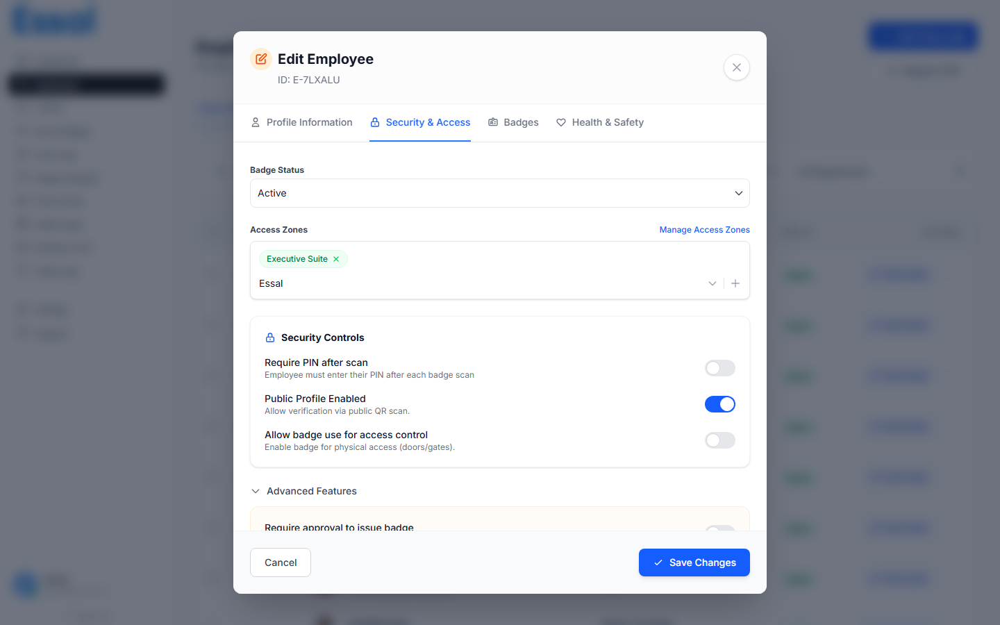

{/* keywords: modifier un employé, mettre à jour un employé, modale employé, onglet profil, onglet sécurité, onglet badges, onglet santé sécurité, modifier un employé */}
{/* category: Employee Management */}
{/* audience: Admins, Managers */}

Cet article explique comment ouvrir l'enregistrement d'un employé et naviguer dans les quatre onglets disponibles dans la modale d'employé — Profil, Sécurité, Badges et Santé & Sécurité.

---

## Ouvrir la modale d'employé

Accédez aux **Employés** dans la barre latérale pour ouvrir la liste des employés.

Cliquez sur le bouton **Modifier** (bleu, libellé "Modifier") sur n'importe quelle ligne pour ouvrir la modale d'employé. Vous pouvez également cliquer sur le **nom** de l'employé — cela ouvre la même modale sur l'onglet Profil.

L'en-tête de la modale affiche :

- **"Modifier l'employé"** comme titre
- L'identifiant unique de l'employé sous le titre (p. ex. `EMP-A3F7K2`)
- Un bouton de fermeture (×) en haut à droite

> **Modifications non enregistrées** : Si vous apportez des modifications et essayez de fermer la modale sans enregistrer, une invite de confirmation apparaîtra. Cliquez sur **Ignorer** pour perdre les modifications ou **Continuer l'édition** pour rester.

---

## Naviguer dans les quatre onglets

La modale comporte quatre onglets en haut. Cliquez sur un onglet pour basculer, ou utilisez les raccourcis clavier `Ctrl+1` à `Ctrl+4`.

| Onglet               | Raccourci | Contenu                                                                          |
| -------------------- | --------- | -------------------------------------------------------------------------------- |
| **Profil**           | `Ctrl+1`  | Informations personnelles, détails organisationnels, photo, champs personnalisés |
| **Sécurité**         | `Ctrl+2`  | Statut du badge, zones d'accès, PIN 2FA, planning d'accès, contrôles avancés     |
| **Badges**           | `Ctrl+3`  | Historique complet des badges — émettre, révoquer ou réactiver des badges        |
| **Santé & Sécurité** | `Ctrl+4`  | Contact d'urgence, allergies, conditions médicales, certifications de sécurité   |

---

## Onglet Profil

L'onglet Profil contient toutes les informations de base de l'employé. Consultez Ajouter un nouvel employé pour une référence complète des champs.

Points clés lors de la modification :

- **L'identifiant employé** est en lecture seule après le premier enregistrement — il ne peut pas être modifié
- **Le département** doit déjà exister dans Paramètres → Départements avant d'être sélectionnable
- **Les champs personnalisés** apparaissent en bas du formulaire si votre admin en a défini dans Paramètres → Champs personnalisés

---

## Onglet Sécurité

L'onglet Sécurité contrôle le comportement du badge de l'employé lors du scan et les restrictions d'accès applicables.

### Statut du badge

Le menu déroulant **Statut** propose trois options que vous pouvez définir directement :

| Statut           | Effet                                                                                 |
| ---------------- | ------------------------------------------------------------------------------------- |
| **Actif**        | Le badge est valide ; les scans sont traités normalement                              |
| **Suspendu**     | Le badge est temporairement désactivé ; les scans sont refusés                        |
| **Perdu / Volé** | Le badge est définitivement désactivé immédiatement ; un nouveau badge doit être émis |

> **Remarque** : Les statuts `En attente` et `Résilié` sont définis via les actions de la liste des employés (Approuver, Résilier), pas depuis ce menu déroulant.

### Zones d'accès

Les zones d'accès définissent les zones physiques auxquelles cet employé peut accéder. Lorsqu'un dispositif de pointage est assigné à une zone, il n'accordera l'entrée qu'aux employés affectés à cette zone.

- Les **zones actuelles** apparaissent comme des étiquettes supprimables — cliquez sur × pour en supprimer une
- Utilisez le **menu déroulant de zone** pour ajouter des zones supplémentaires
- Si aucune zone n'est assignée, l'employé peut être scanné à n'importe quel dispositif
- Cliquez sur **Gérer les zones d'accès** pour ouvrir la page des paramètres de zone

### Contrôles de sécurité

| Paramètre                                                     | Ce qu'il fait                                                                                   |
| ------------------------------------------------------------- | ----------------------------------------------------------------------------------------------- |
| **Exiger un PIN après le scan**                               | Les employés doivent saisir un PIN à 4 chiffres au scanner après le scan de leur QR code.       |
| **Profil public activé**                                      | Activé : le scan du QR ouvre le profil public de l'employé. Désactivé : les scans sont bloqués. |
| **Autoriser l'utilisation du badge pour le contrôle d'accès** | Active l'intégration du contrôle d'accès physique.                                              |

### PIN 2FA

Lorsque **Exiger un PIN après le scan** est activé :

- Un champ numérique à 4 chiffres apparaît
- Cliquez sur **Générer** pour créer un PIN aléatoire automatiquement
- Le PIN est stocké chiffré ; partagez-le avec l'employé séparément

### Accès à horaires restreints

Activez la case **Accès à horaires restreints** pour restreindre la validité du badge :

- Définissez les heures **De** et **Jusqu'à** avec les sélecteurs de temps
- Activez les jours individuels avec les boutons **Di Lu Ma Me Je Ve Sa** (bleu = autorisé)
- En dehors de la fenêtre autorisée, les scans sont refusés avec un message "hors planning"

### Fonctionnalités avancées

| Paramètre                                                   | Quand l'utiliser                                                                                                       |
| ----------------------------------------------------------- | ---------------------------------------------------------------------------------------------------------------------- |
| **Exiger une approbation pour émettre un badge**            | L'employé passe au statut `En attente` et doit être approuvé manuellement.                                             |
| **Afficher le profil uniquement aux scanners authentifiés** | Restreint la visibilité du profil aux dispositifs de pointage enregistrés uniquement.                                  |
| **Exiger une pièce d'identité avec le badge**               | L'application de pointage affiche une invite demandant à l'agent de sécurité de vérifier la pièce d'identité physique. |

---

## Onglet Badges

L'onglet Badges affiche l'historique complet des badges de cet employé.

### Émettre un nouveau badge

Cliquez sur **Émettre un nouveau badge** pour générer un badge avec un identifiant unique. Cela :

1. Crée une nouvelle entrée de badge avec le statut `Actif`
2. Désactive tout badge actuellement actif
3. Met à jour l'`activeBadgeId` de l'employé

### Révoquer et réactiver

- **Révoquer** (affiché sur les badges actifs) — marque le badge comme `Perdu` et le désactive
- **Réactiver** (affiché sur les badges inactifs/perdus) — restaure le badge en `Actif`

---

## Onglet Santé & Sécurité

L'onglet Santé & Sécurité stocke les données sensibles des employés pour la gestion des urgences et de la sécurité au travail.

| Section                               | Champs                                                                         |
| ------------------------------------- | ------------------------------------------------------------------------------ |
| **Contact d'urgence**                 | Nom, Téléphone, Relation                                                       |
| **Allergies**                         | Liste d'étiquettes — saisissez et appuyez sur Entrée ou cliquez sur Ajouter    |
| **Conditions médicales**              | Liste d'étiquettes — même interaction                                          |
| **Handicaps / Notes supplémentaires** | Champ de texte libre                                                           |
| **Équipements de protection (EPI)**   | Liste d'étiquettes pour les équipements requis                                 |
| **Certifications de sécurité**        | Liste de certifications avec nom, numéro, date d'émission et date d'expiration |

---

## Enregistrer les modifications

Cliquez sur **Enregistrer** en bas à droite de la modale, ou appuyez sur `Alt+S`. Le bouton est désactivé si le Prénom ou le Nom est vide.
