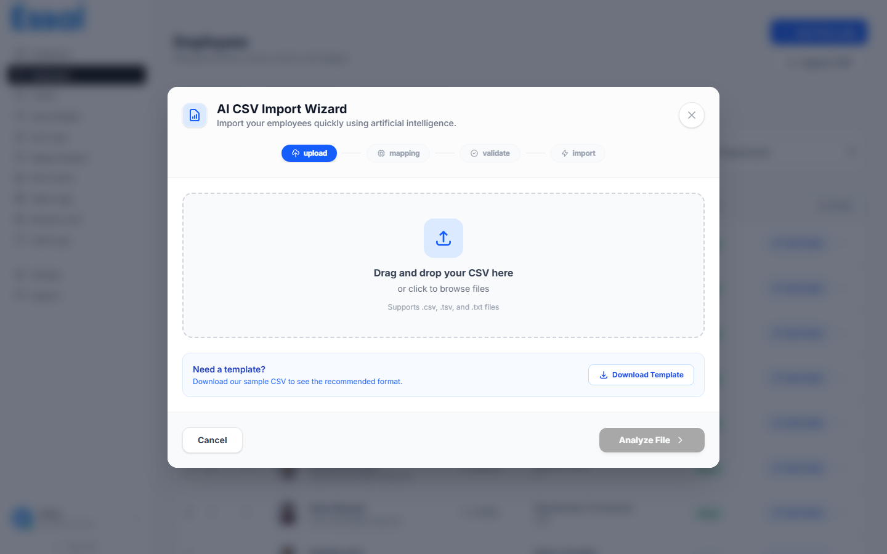

{/* keywords: import CSV, importation en masse, importer des employés, feuille de calcul d'employés, assistant d'importation, correspondance de colonnes, ajout en masse, export RH */}
{/* category: Employee Management */}
{/* audience: Admins, Managers */}

L'assistant d'importation CSV vous permet d'ajouter de nombreux employés à la fois depuis une feuille de calcul. Cet article décrit chaque étape de l'assistant en 4 étapes.

Accédez aux **Employés** dans la barre latérale, puis cliquez sur **Importer CSV** en haut à droite (ou appuyez sur `Alt+I`).

---

## Avant de commencer

Préparez vos données :

- Exportez votre liste d'employés depuis votre système RH au format CSV, ou remplissez le modèle téléchargeable
- Assurez-vous qu'au moins les colonnes **Prénom** et **Nom** sont présentes — ce sont les seuls champs obligatoires
- Les dates doivent être dans un format standard (p. ex. `YYYY-MM-DD` ou `MM/DD/YYYY`)
- Les valeurs de groupe sanguin doivent être : `A+`, `A-`, `B+`, `B-`, `AB+`, `AB-`, `O+` ou `O-`

**Formats de fichier pris en charge** : `.csv`, `.tsv`, `.txt`

---

## Étape 1 — Télécharger votre fichier

Faites glisser votre fichier sur la zone de téléchargement, ou cliquez n'importe où dans la zone pour parcourir et sélectionner un fichier.

Après le chargement du fichier, l'assistant affiche :

- **Nombre de lignes** — le nombre de lignes de données détectées
- **Nombre de colonnes** — le nombre de colonnes d'en-têtes
- **Taille du fichier**
- **Colonnes détectées** — une liste de tous les en-têtes de colonnes trouvés dans le fichier

Si vous n'avez pas de fichier prêt, cliquez sur **Télécharger le modèle** pour obtenir un CSV pré-formaté avec tous les en-têtes de champs standard remplis.

---

## Étape 2 — Associer les colonnes

Essal Access associe automatiquement vos colonnes CSV aux champs d'employés à l'aide d'une inférence assistée par IA. Le tableau d'association affiche :

| Colonne              | Contenu                                                                                          |
| -------------------- | ------------------------------------------------------------------------------------------------ |
| **Colonne CSV**      | Le nom d'en-tête de votre fichier                                                                |
| **Valeur d'exemple** | La première valeur de données de cette colonne                                                   |
| **Confiance**        | Un point indiquant la confiance de l'association : vert (haute), jaune (moyenne), rouge (faible) |
| **Associé à**        | Le champ d'employé que cette colonne remplira                                                    |

Vérifiez les associations et corrigez celles qui sont incorrectes à l'aide du menu déroulant **Associé à**. Les options incluent :

- **Ignorer** — ignorer complètement cette colonne
- **Nom complet → Prénom + Nom** — divise une seule colonne nom complet (p. ex. `"Jean Dupont"` → Prénom : `Jean`, Nom : `Dupont`)
- Tous les champs d'employés standard (voir tableau ci-dessous)
- Tout champ personnalisé défini dans Paramètres → Champs personnalisés

### Champs standard importables

| Champ                 | Obligatoire |
| --------------------- | ----------- |
| Prénom                | **Oui**     |
| Nom                   | **Oui**     |
| E-mail                | Non         |
| Rôle / Titre de poste | Non         |
| Département           | Non         |
| Numéro de téléphone   | Non         |
| Adresse               | Non         |
| Ville                 | Non         |
| État / Province       | Non         |
| Code postal           | Non         |
| Nationalité           | Non         |
| Date de naissance     | Non         |
| Groupe sanguin        | Non         |
| Bio / Description     | Non         |

---

## Étape 3 — Aperçu et validation

Avant l'importation, l'assistant valide chaque ligne. Trois compteurs apparaissent en haut :

- **Prêt** — lignes qui ont passé la validation et seront importées
- **Avertissements** — lignes avec des problèmes mineurs qui seront quand même importées
- **Erreurs** — lignes qui ne peuvent pas être importées telles quelles

Le tableau d'aperçu affiche les 10 premières lignes valides et toutes les lignes d'erreur. Chaque ligne a une étiquette de statut :

- **OK** (vert) — valide, sera importé
- **Avertissement** (ambré) — sera importé avec le problème noté
- **Erreur** (rouge) — sera ignoré sauf si vous choisissez d'importer quand même

### Gérer les erreurs

Deux options lorsque des erreurs existent :

1. **Corriger le fichier** — cliquez sur **Retour**, corrigez les problèmes dans votre feuille de calcul et retéléchargez
2. **Ignorer les erreurs et importer quand même** — cochez la case **Ignorer les erreurs**. Les lignes d'erreur sont ignorées ; toutes les lignes valides sont importées
3. **Télécharger le rapport d'erreurs** — exporte un CSV listant chaque ligne d'erreur avec la description du problème

---

## Étape 4 — Importer

Cliquez sur **Importer** pour démarrer. Une barre de progression suit l'opération :

- **Importé** — lignes ajoutées avec succès jusqu'à présent
- **Échoué** — lignes qui ont rencontré une erreur lors de l'insertion
- **Traité** — total des lignes gérées jusqu'à présent
- **ETA** — temps restant estimé

L'importation s'exécute par lots de 50 lignes. Vous pouvez cliquer sur **Annuler l'importation** pour arrêter après la fin du lot actuel — les lignes déjà traitées sont conservées.

### Après l'importation

Une fois terminé, un résumé affiche le nombre de lignes importées avec succès, échouées et ignorées. Les nouveaux employés apparaissent immédiatement dans la liste des employés avec le statut **Actif**.
