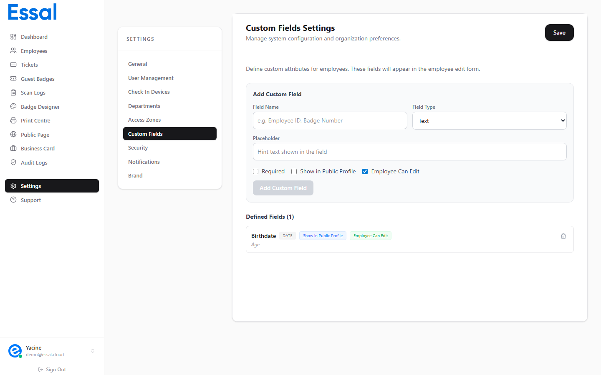

{/* keywords: champs personnalisés, attributs employé, champs supplémentaires, champ sélection, champ texte, afficher sur badge */}
{/* category: Employee Management */}
{/* audience: Admins */}

Les champs personnalisés vous permettent d'étendre les fiches employés avec des données spécifiques à votre organisation — numéro de permis de conduire, taille de vêtement, compétences linguistiques, ou tout autre attribut que les champs standards ne couvrent pas.

---

## Accéder aux champs personnalisés

1. Cliquez sur **Paramètres** dans la barre latérale
2. Ouvrez l'onglet **Champs personnalisés**

---

## Créer un champ personnalisé

1. Cliquez sur **Ajouter un champ**
2. Saisissez un **Nom** (s'affichera dans les fiches employés et sur le badge si activé)
3. Sélectionnez un **Type** parmi :

| Type | Description |
|---|---|
| Texte | Champ de saisie libre |
| Nombre | Valeurs numériques uniquement |
| Date | Sélecteur de date |
| E-mail | Adresse e-mail avec validation de format |
| Téléphone | Numéro de téléphone |
| URL | Lien web |
| Sélection | Menu déroulant avec options prédéfinies |

4. Configurez les options du champ (voir ci-dessous)
5. Cliquez sur **Enregistrer**

---

## Options de configuration du champ

Chaque champ peut avoir les options suivantes activées ou désactivées :

| Option | Effet |
|---|---|
| **Requis** | Les fiches employés ne peuvent pas être enregistrées sans une valeur pour ce champ |
| **Afficher sur le badge** | La valeur apparaît sur le badge imprimé si le champ correspondant est activé dans le Badge Designer |
| **Afficher sur le profil public** | Visible sur la page de profil public accessible par QR code |
| **Autoriser l'auto-modification** | L'employé peut modifier ce champ depuis le Portail Employé |

---

## Champs de type Sélection

Pour les champs de type **Sélection**, saisissez les options disponibles, une par ligne, dans le champ **Options** lors de la création ou de la modification du champ.

Lors de l'importation CSV, vous devez utiliser exactement la valeur de l'option (respect de la casse) pour que l'importation corresponde correctement.

---

## Modifier et supprimer des champs

- **Modifier** : Cliquez sur l'icône crayon à côté du champ pour changer son nom, son type ou ses options.
- **Supprimer** : Cliquez sur l'icône corbeille.

> **Attention** : La suppression d'un champ personnalisé efface **définitivement toutes les données employés** stockées dans ce champ. Cette action est irréversible.

---

## Où apparaissent les champs personnalisés

- **Fiche employé** (onglet Profil) — section dédiée sous les champs standards
- **Importation CSV** — les colonnes dont le nom correspond aux champs personnalisés sont automatiquement mappées
- **Badge** — si l'option "Afficher sur le badge" est activée et que le champ est visible dans le Badge Designer
- **Profil public** — si l'option "Afficher sur le profil public" est activée
- **Portail Employé** — si "Autoriser l'auto-modification" est activé, les employés voient et peuvent modifier leurs valeurs
