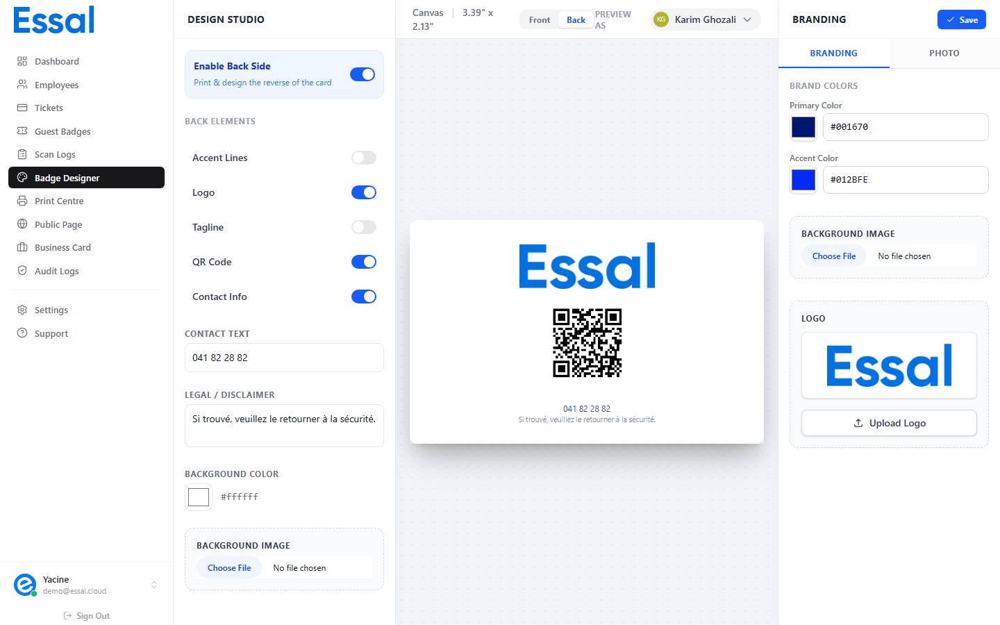

{/* keywords: verso badge, dos badge, activer verso, QR code verso, texte légal badge, fond verso, image fond verso */}
{/* category: Badge Design & Templates */}
{/* audience: Admins */}

Le verso du badge est facultatif. Lorsqu'il est activé, il s'imprime dans le Centre d'impression aux côtés du recto et peut afficher des informations supplémentaires telles que des coordonnées, un logo, un QR code ou un texte légal.

---

## Accéder à la configuration du verso

1. Ouvrez le **Badge Designer** depuis la barre latérale
2. Dans le sélecteur **Recto/Verso** au sommet du panneau central, cliquez sur **Verso**
3. Dans le **panneau gauche**, activez le bouton bascule **Activer le verso**

---

## Éléments du verso

Une fois le verso activé, vous pouvez activer ou désactiver les éléments suivants :

| Élément | Description |
|---|---|
| **Lignes d'accentuation** | Bandes décoratines dans la couleur d'accentuation |
| **Logo** | Le logo de l'entreprise (même image que sur le recto) |
| **Slogan** | Courte phrase de marque ou description de l'organisation |
| **QR Code** | Même QR que le recto — renvoie vers la page de profil public de l'employé |
| **Informations de contact** | Champ de texte libre (ex. : adresse, téléphone du siège, e-mail RH) |

---

## Texte légal et mentions

Le champ **Mentions légales / Avertissement** affiche du texte en très petite taille au bas du verso dans la couleur principale à opacité réduite.

Utilisez ce champ pour les avertissements de sécurité requis, les numéros de téléphone d'urgence, les clauses de confidentialité ou tout autre texte de conformité.

---

## Couleur de fond du verso

Par défaut, le fond du verso utilise votre **Couleur d'accentuation**. Vous pouvez choisir une couleur différente spécifiquement pour le verso sans modifier la couleur d'accentuation principale.

---

## Image de fond (Verso)

Téléchargez une image de fond distincte pour le verso.

- Taille maximale : 2 Mo
- Distincte de l'image de fond du recto — chaque face a sa propre image

---

## Impression avec le verso activé

Lorsque le verso est activé, le **Centre d'impression** inclut automatiquement le verso dans tous les travaux d'impression. Les feuilles imprimées contiendront à la fois le recto et le verso côte à côte (ou positionnés pour une impression recto-verso selon votre configuration d'imprimante).

---

## Enregistrer les modifications

Cliquez sur **Enregistrer** en haut à droite du panneau droit. Les modifications s'appliquent immédiatement à tous les badges.
