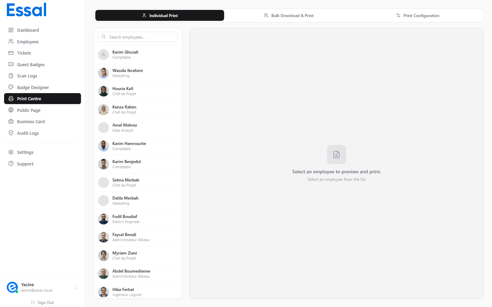

{/* keywords: imprimer badge, imprimer badge employé, impression badge individuel, aperçu avant impression, télécharger badge PNG, badge PDF */}
{/* category: Printing & Exporting Badges */}
{/* audience: Admins, Managers */}

Cet article explique comment imprimer ou télécharger le badge d'un seul employé sous forme d'image PNG directement depuis Essal Access.

---

## Deux Façons d'Ouvrir l'Impression Individuelle

### Depuis la Liste des Employés

1. Naviguez vers **Employés** dans la barre latérale.
2. Survolez n'importe quelle ligne d'employé — une rangée d'icônes d'action apparaît sur la droite.
3. Cliquez sur l'icône **Imprimer** (icône d'imprimante).
4. Vous êtes dirigé vers le Centre d'Impression avec cet employé déjà sélectionné et l'aperçu du badge chargé.

### Depuis le Tableau de Bord ou la Barre Latérale

1. Cliquez sur **Centre d'Impression** dans la barre latérale, ou cliquez sur les cartes d'action rapide **Émettre un Badge** / **Centre d'Impression** sur le Tableau de Bord.
2. Le Centre d'Impression s'ouvre sur l'onglet **Individuel**.
3. Utilisez la liste de recherche des employés à gauche pour trouver et sélectionner un employé.
4. L'aperçu du badge se met à jour immédiatement sur la droite.

---

## Le Centre d'Impression — Onglet Individuel

L'onglet Individuel comporte deux panneaux :

**Panneau de gauche — Sélecteur d'employé**

- Boîte de recherche pour filtrer les employés par nom.
- Liste déroulante de tous les employés avec leur avatar, nom et département.
- Cliquez sur n'importe quel employé pour charger son badge dans l'aperçu.

**Panneau de droite — Aperçu du badge**

- Rendu en direct du badge utilisant le modèle de badge actuel et les données de l'employé sélectionné.
- Affiche le recto par défaut ; si le verso du badge est activé, les deux côtés sont affichés.

---

## Impression via le Navigateur

Cliquez sur **Imprimer le Badge** pour ouvrir la boîte de dialogue d'impression de votre navigateur.

Conseils pour de meilleurs résultats :

- Réglez le **format de papier** pour qu'il corresponde à votre support de badge (carte CR80, feuille A4, etc.).
- Réglez les **marges** sur **Aucune** ou **Minimum** dans la boîte de dialogue d'impression.
- Désactivez les **En-têtes et pieds de page** dans les paramètres du navigateur.
- Sélectionnez **Graphiques d'arrière-plan** (ou équivalent) pour que les couleurs du badge s'impriment correctement.
- Utilisez une **Échelle : 100%** — le badge est pré-dimensionné pour des proportions précises.

La boîte de dialogue d'impression du navigateur utilise la mise en page du badge exactement telle qu'elle a été configurée dans le Badge Designer. Aucun redimensionnement supplémentaire n'est nécessaire.

---

## Téléchargement en PNG

Cliquez sur **Télécharger en PNG** pour enregistrer le badge sous forme de fichier image haute résolution.

Le PNG téléchargé :

- Résolution : environ **1720 × 2720 px** pour un badge standard (avec un ratio de pixels de 4x).
- Nom du fichier : `{Prénom}_{Nom}_{IDBadge}.png`
- Prêt à être envoyé à une imprimerie ou intégré dans d'autres documents.
- Comprend uniquement le recto du badge (le verso nécessite l'exportation ZIP groupée).

> **Note** : Le téléchargement PNG traite le badge à haute résolution et peut prendre 2 à 5 secondes. Un indicateur de chargement s'affiche pendant le rendu.

---

## Après l'Impression

La mise en page du badge imprimé utilise votre modèle actif du Badge Designer. Si vous avez récemment modifié le design du badge, l'aperçu avant impression reflète immédiatement ces changements — pas besoin de rafraîchir.

Pour imprimer les badges de tous les employés en une seule fois, consultez Impression Groupée de Plusieurs Badges.
