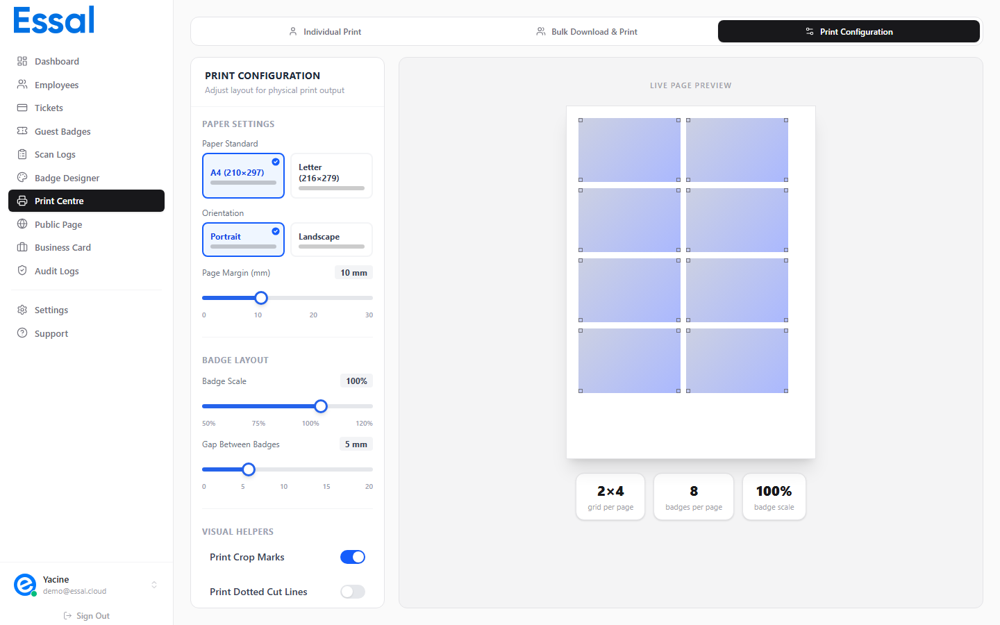

{/* keywords: paramètres d'impression, format de papier, échelle du badge, repères de coupe, lignes de découpe, espacement de la grille, marge de la page, configuration d'impression, A4, Letter, orientation */}
{/* category: Printing & Exporting Badges */}
{/* audience: Admins, Managers */}

L'onglet **Configuration** du Centre d'Impression contrôle la disposition des badges sur la page imprimée. Cet article explique chaque paramètre et son effet sur le résultat final.

---

## Accéder aux Paramètres d'Impression

1. Allez dans le **Centre d'Impression** dans la barre latérale.
2. Cliquez sur l'onglet **Configuration** (troisième onglet, après Individuel et Groupé).

Les modifications prennent effet immédiatement — l'aperçu de la page en direct sur la droite se met à jour en temps réel à mesure que vous ajustez chaque paramètre.

---

## Paramètres du Papier

### Format de Papier

| Option     | Dimensions                            |
| ---------- | ------------------------------------- |
| **A4**     | 210 × 297 mm (standard international) |
| **Letter** | 216 × 279 mm (standard US)            |

Choisissez le format de papier qui correspond à celui sur lequel vous imprimez. Cela affecte le nombre de badges pouvant tenir par page.

### Orientation

| Option       | Description                                               |
| ------------ | --------------------------------------------------------- |
| **Portrait** | Page haute (par défaut) — permet plus de lignes de badges |
| **Paysage**  | Page large — permet plus de colonnes de badges            |

Pour les badges au format CR80 (orientation paysage), l'orientation de la page en **Paysage** offre généralement la disposition la plus efficace.

### Marge de la Page

Contrôle la zone vierge autour de toute la page avant que les badges ne commencent.

- Plage : **0–30 mm**, par paliers de 1 mm.
- Par défaut : **10 mm**.
- Réduisez cette valeur si vous voulez des badges plus proches du bord (utile lors de la découpe manuelle des cartes).
- Augmentez-la si votre imprimante nécessite une marge non imprimable plus large.

---

## Mise en Page des Badges

### Échelle des Badges

Contrôle la taille de chaque badge par rapport à sa taille d'impression naturelle.

- Plage : **50%–120%**, par paliers de 5%.
- Par défaut : **100%**.
- À 100%, un badge standard CR80 s'imprime à sa taille réelle de carte physique (85,6 × 54 mm).
- Réduisez pour faire tenir plus de badges par page ; augmentez pour remplir la page avec moins de badges, mais plus grands.
- L'aperçu en direct affiche le nombre de colonnes × lignes résultant et le nombre de badges par page.

> **Conseil** : Si un badge à l'échelle 100% ne rentre pas correctement sur votre support de carte, réduisez à 90% ou 95% pour ajouter une petite marge de sécurité.

### Espacement de la Grille (Grid Gap)

Contrôle l'espacement entre les badges adjacents sur la page.

- Plage : **0–20 mm**, par paliers de 1 mm.
- Par défaut : **5 mm**.
- Des espaces plus grands facilitent la découpe des cartes à la main.
- Réglez sur 0 mm si vous utilisez un découpeur de cartes avec un repérage précis.

---

## Aides Visuelles

Ces paramètres ajoutent des lignes de guidage à la sortie imprimée pour aider à la découpe.

### Repères de Coupe (Crop Marks)

- Par défaut : **Activé**.
- Ajoute de petits repères d'angle en forme de L à chaque coin de chaque badge.
- Ces marques s'étendent à l'extérieur de la bordure du badge afin de rester visibles après l'impression, même si le badge remplit jusqu'au bord.
- Utilisez les repères de coupe lors de la découpe aux ciseaux ou avec un massicot manuel.

### Lignes de Découpe (Cut Lines)

- Par défaut : **Désactivé**.
- Ajoute une bordure pointillée tout autour du périmètre de chaque badge.
- Plus visibles que les repères de coupe — plus faciles à voir pour une découpe à la main.
- Peuvent être utilisées en complément des repères de coupe ou à leur place.

> **Pour une découpe professionnelle** : Les repères de coupe seuls (sans lignes de découpe) sont la norme pour les travaux d'imprimerie. Les lignes de découpe sont préférables pour une découpe au bureau où le trait de guidage doit être bien visible.

---

## Aperçu en Direct

Le côté droit de l'onglet Configuration affiche un aperçu réduit de la page d'impression avec vos paramètres actuels appliqués. Il affiche :

- La disposition de la grille de badges (nombre de colonnes et de lignes).
- Des rendus d'exemples de badges dans la grille.
- Le nombre de badges par page.
- L'interaction de tous les paramètres entre eux.

L'aperçu est purement visuel — il n'utilise pas les données réelles des employés. Les badges affichent un contenu fictif.

---

## Tableau Récapitulatif des Paramètres

| Paramètre         | Plage              | Par défaut | Effet                                                  |
| ----------------- | ------------------ | ---------- | ------------------------------------------------------ |
| Format Papier     | A4 ou Letter       | A4         | Dimensions de la page                                  |
| Orientation       | Portrait / Paysage | Portrait   | Rotation de la page                                    |
| Marge Page        | 0–30 mm            | 10 mm      | Bordure autour de la page                              |
| Échelle Badge     | 50–120%            | 100%       | Taille du badge par rapport aux dimensions d'une carte |
| Espacement Grille | 0–20 mm            | 5 mm       | Espace entre les badges                                |
| Repères de Coupe  | Activé / Désactivé | Activé     | Guides de coupe d'angle                                |
| Lignes de Coupe   | Activé / Désactivé | Désactivé  | Guide de coupe complet en pointillés                   |
