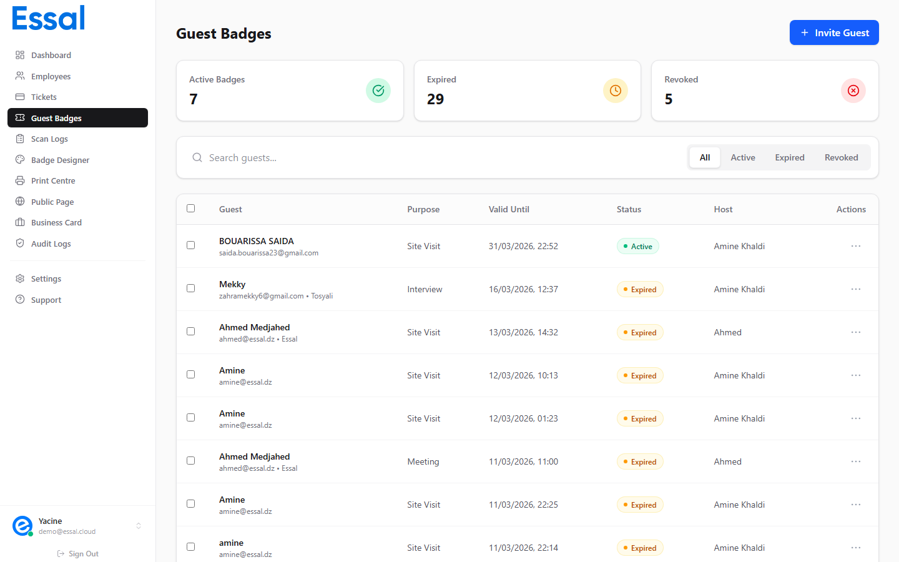

{/* keywords: badge visiteur, badge invité, badge temporaire, accès visiteur, badge code QR, laissez-passer visiteur */}
{/* category: Guest Badges */}
{/* audience: Admins, Managers, Reception */}

Les Badges Visiteurs sont des laissez-passer temporaires basés sur des codes QR que vous pouvez créer pour les visiteurs, les prestataires, les participants à des événements, le personnel de livraison ou toute autre personne ayant besoin d'un accès de courte durée à votre établissement — sans qu'il ne soit nécessaire de leur créer un compte employé.



---

## Fonctionnement des Badges Visiteurs

Lorsque vous créez un Badge Visiteur, Essal Access génère un lien unique et partageable au format suivant :

```
https://idpage.link/guest/{token}
```

Ce lien (et son code QR intégré) peut être :

- **Envoyé par e-mail** directement au visiteur au moment de sa création — Essal envoie l'invitation automatiquement.
- **Copié et partagé** manuellement via n'importe quel canal (SMS, WhatsApp, e-mail imprimé, etc.).
- **Scanné à l'entrée** par un agent de sécurité à l'aide de n'importe quel lecteur de QR code ou dispositif d'enregistrement.

Aucune application, aucun compte ou identifiant n'est requis pour que le visiteur puisse utiliser son badge.

---

## Différences entre Badges Visiteurs et Badges Employés

| Caractéristique                          | Badge Employé | Badge Visiteur            |
| ---------------------------------------- | ------------- | ------------------------- |
| Nécessite un profil employé              | ✓             | ✗                         |
| Utilise un modèle de design personnalisé | ✓             | ✗                         |
| Possède une période de validité          | ✗ (permanent) | ✓ (définie à la création) |
| Peut être révoqué manuellement           | ✗             | ✓                         |
| Lien public pour vérification            | ✗             | ✓                         |
| Envoyé par invitation e-mail             | ✗             | ✓                         |

---

## Quand Utiliser les Badges Visiteurs

- **Visites de site** — clients externes, partenaires ou inspecteurs visitant les locaux.
- **Entretiens** — candidats arrivant pour des entretiens sur place.
- **Réunions** — participants à des réunions physiques planifiées.
- **Livraisons** — coursiers ou personnel logistique nécessitant un accès temporaire.
- **Événements** — participants à une conférence, une journée portes ouvertes ou une session de formation.
- **Prestataires** — travailleurs temporaires n'ayant pas besoin d'un compte employé complet.

---

## Concepts Clés

- **Fenêtre de validité** — chaque badge a un horodatage `valide du` et `valide jusqu'au`. Les agents de sécurité peuvent le voir sur la page scannée.
- **Zones d'accès** — si votre organisation a défini des zones d'accès, vous pouvez spécifier les zones dans lesquelles le visiteur est autorisé à entrer.
- **Expiration automatique** — les badges dont l'heure `valide jusqu'au` est passée s'affichent automatiquement comme **Expirés** sans aucune action manuelle.
- **Révocation** — un administrateur peut révoquer manuellement un badge à tout moment, l'invalidant instantanément même si la fenêtre de validité n'est pas terminée.
