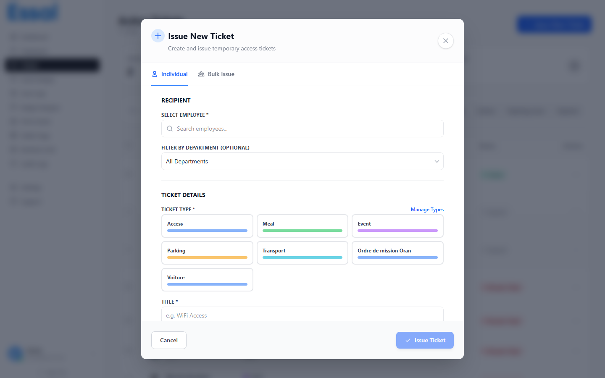

{/* keywords: créer ticket, émettre ticket, nouveau ticket, émission groupée, ticket département */}
{/* category: Tickets */}
{/* audience: Admins, Managers */}

Les tickets peuvent être émis pour un seul employé ou pour tous les employés actifs d'un département en une seule fois.

---

## Ouvrir la Fenêtre de Création

1. Naviguez vers **Tickets** dans la barre latérale.
2. Cliquez sur le bouton **Nouveau Ticket** (ou **+ Émettre Ticket**) dans le coin supérieur droit.
3. La fenêtre modale **Créer un Ticket** s'ouvre.

---

## Émission à un Employé Individuel

La fenêtre s'ouvre par défaut en mode **Individuel**.

### Étape 1 — Sélectionner le Destinataire

- Tapez dans le champ de recherche d'employé — les résultats s'affichent sous forme de liste déroulante filtrée uniquement sur les employés actifs.
- Utilisez éventuellement le menu déroulant **Filtrer par département** pour limiter la recherche à un département spécifique.
- Cliquez sur le nom de l'employé dans la liste pour le sélectionner.

### Étape 2 — Sélectionner le Type de Ticket

Choisissez le type de ticket en cliquant sur l'une des cartes de type. Chaque carte affiche le nom et la couleur du type. La carte sélectionnée est mise en surbrillance.

### Étape 3 — Renseigner les Détails du Ticket

| Champ                | Requis      | Notes                                                                                      |
| -------------------- | ----------- | ------------------------------------------------------------------------------------------ |
| **Titre**            | ✓           | Un libellé court pour ce ticket spécifique (ex : "Pass Parking T2 2026")                   |
| **Description**      | Optionnel   | Détails supplémentaires affichés sur la page de vérification                               |
| **Emplacement**      | Optionnel   | Lieu ou zone concerné par ce ticket                                                        |
| **Le ticket expire** | —           | Case à cocher (cochée par défaut) ; décochez pour un ticket permanent                      |
| **Validité (jours)** | ✓ si expire | Nombre de jours à partir d'aujourd'hui durant lesquels le ticket est valide ; par défaut 7 |

### Étape 4 — Émettre

Cliquez sur **Émettre le Ticket** pour créer le ticket. La fenêtre se ferme et le ticket apparaît dans la liste.

---

## Émission à tout un Département (Groupée)

Passez à l'onglet **En masse** en haut de la fenêtre modale.

1. Sélectionnez un **département** dans la liste déroulante — le nombre d'employés actifs est affiché (ex : "Ingénierie (12)").
2. Remplissez les détails du ticket (mêmes champs qu'en individuel — titre, type, validité, etc.).
3. Cliquez sur **Émettre au Département**.
4. Une boîte de dialogue de confirmation affiche le nombre de tickets qui seront créés — confirmez pour continuer.
5. Un ticket avec les mêmes détails est créé simultanément pour chaque employé actif du département.

> **Note :** Les employés ayant le statut inactif, suspendu ou licencié sont automatiquement exclus de l'émission groupée.

---

## Ticket n'expirant jamais

Pour émettre un ticket sans date d'expiration, décochez la case **Le ticket expire**. Le champ de validité disparaît et le ticket restera actif jusqu'à ce qu'il soit manuellement révoqué ou supprimé. La page de vérification affichera **"N'expire jamais"** en vert.

---

## Après l'Émission

Une fois émis, vous pouvez :

- **Copier le lien du ticket** via le menu à trois points — partagez-le avec l'employé pour qu'il puisse y accéder sur son téléphone.
- **Voir le ticket** en détail pour confirmer que tous les champs sont corrects.
- **Révoquer** le ticket immédiatement s'il a été émis par erreur.
