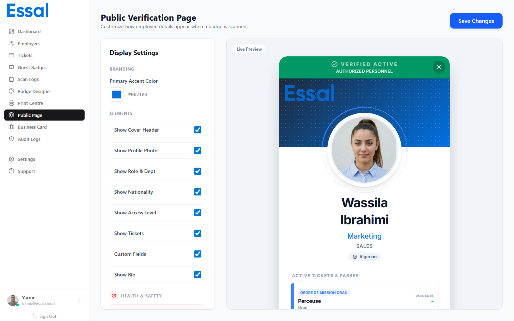

{/* category: Public Profiles & QR Scanning */}

L'Éditeur de Page Publique permet aux administrateurs de contrôler exactement quelles informations apparaissent lorsqu'un badge d'employé est scanné. Vous pouvez activer ou désactiver des champs individuels, définir la couleur de la marque, télécharger une photo de couverture et contrôler les autorisations globales de scan.

---

## Ouvrir l'Éditeur

Allez dans **Paramètres** → **Éditeur de Page Publique** dans la navigation d'administration, ou naviguez directement vers `/public-page-editor`. Un aperçu en direct sur la droite se met à jour au fur et à mesure de vos modifications.

---

## Identité Visuelle (Branding)

**Couleur primaire** — définit la couleur d'accentuation utilisée pour la bande de couverture en haut du profil et pour les boutons. Cliquez sur l'échantillon de couleur pour ouvrir un sélecteur de couleurs, ou tapez directement une valeur hexadécimale.

---

## Boutons d'Affichage

Utilisez les interrupteurs (toggles) pour afficher ou masquer chaque section du profil public :

| Interrupteur                | Ce qu'il contrôle                                                 |
| --------------------------- | ----------------------------------------------------------------- |
| **Couverture**              | Barre d'en-tête colorée en haut du profil                         |
| **Photo de profil**         | Photo téléchargée par l'employé                                   |
| **Infos professionnelles**  | Rôle, département                                                 |
| **Nationalité**             | Champ nationalité de l'employé                                    |
| **Niveau d'accès**          | Zones d'accès attribuées à l'employé                              |
| **Tickets**                 | Tous les tickets actifs liés à l'employé                          |
| **Attributs personnalisés** | Tout champ personnalisé marqué comme visible sur le profil public |
| **Bio**                     | Biographie / texte de résumé de l'employé                         |

**Section Contact :**

- **Afficher les infos de contact** — interrupteur principal pour tous les détails de contact
- **Afficher l'e-mail** — adresse e-mail de l'employé (nécessite l'interrupteur contact activé)
- **Afficher le téléphone** — numéro de téléphone (nécessite l'interrupteur contact activé)
- **Afficher l'emplacement** — ville et adresse

> Afficher l'e-mail et le téléphone rend ces données visibles publiquement par quiconque scanne le badge. Utilisez ces réglages avec prudence.

**Santé et Sécurité** (affiché séparément) :

- Groupe sanguin, contact d'urgence, allergies, conditions médicales, certifications de sécurité

---

## Contrôles d'Accès Globaux

Ces paramètres se trouvent dans la page principale des **Paramètres** mais affectent directement le scan public :

| Paramètre                                         | Effet                                                                                                                                                             |
| ------------------------------------------------- | ----------------------------------------------------------------------------------------------------------------------------------------------------------------- |
| **Autoriser la vérification publique des badges** | Interrupteur principal marche/arrêt. En cas de désactivation, tous les scans de badges sont bloqués                                                               |
| **Mode carte de visite**                          | Si cette option est activée en même temps que la vérification publique est désactivée, les scans bloqués affichent la carte de visite au lieu d'une page d'erreur |

---

## Enregistrer les Modifications

Les modifications dans l'éditeur sont appliquées immédiatement à l'aperçu en direct. Cliquez sur **Enregistrer** pour appliquer les modifications à tous les profils publics sur l'ensemble du site.
