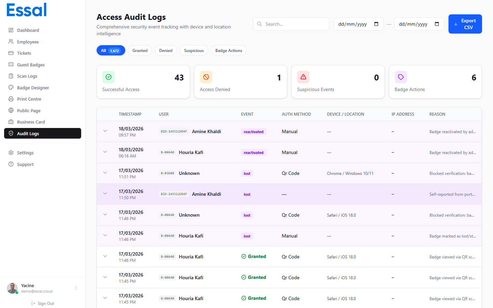

{/* category: Public Profiles & QR Scanning */}

Essal Access maintient deux systèmes de journaux de scan distincts : les **Journaux d'Audit** pour les scans publics de badges et les **Journaux de Scan** pour les scans effectués par les terminaux d'enregistrement. Les deux sont disponibles dans le panneau d'administration.

---

## Journaux d'Audit (Scans Publics de Badges)

**Emplacement :** Panneau d'administration → **Audit Logs** (route : `/audit-logs`)

Les journaux d'audit enregistrent chaque interaction avec un profil de badge public — que le scan ait réussi, ait été bloqué ou ait déclenché une alerte de sécurité.

### Ce qui est enregistré

Chaque entrée du journal d'audit capture :

| Champ               | Description                                       |
| ------------------- | ------------------------------------------------- |
| **Employé**         | Nom de l'employé dont le badge a été scanné       |
| **ID Badge**        | L'identifiant physique du badge utilisé           |
| **Statut**          | Résultat du scan (voir ci-dessous)                |
| **Raison**          | Description compréhensible du résultat            |
| **Horodatage**      | Date et heure du scan                             |
| **Appareil**        | Navigateur et système d'exploitation du scanner   |
| **Type d'appareil** | Ordinateur, mobile ou tablette                    |
| **Adresse IP**      | Résolue automatiquement après le scan             |
| **Méthode d'Auth**  | Comment le scan a été initié (code QR, PIN, etc.) |

### Valeurs de Statut

| Statut             | Signification                                                             |
| ------------------ | ------------------------------------------------------------------------- |
| `success`          | Profil consulté — le badge et l'employé sont actifs                       |
| `denied`           | Scan bloqué (badge invalide, profil désactivé, etc.)                      |
| `badge_lost`       | Le badge a été signalé comme perdu ou volé                                |
| `badge_suspended`  | Le badge ou l'employé est suspendu                                        |
| `badge_terminated` | L'employé a été licencié                                                  |
| `suspicious`       | Activité inhabituelle détectée (ex : badge désactivé en cours de session) |

### Résolution d'Adresse IP

L'adresse IP est résolue de manière asynchrone en arrière-plan après la création de l'événement de scan. Il peut y avoir un court délai pendant lequel l'IP apparaît comme vide le temps que la recherche se termine.

---

## Journaux de Scan (Scans par Terminaux d'Enregistrement)

**Emplacement :** Panneau d'administration → **Scan Logs** (route : `/scan-logs`)

Les journaux de scan enregistrent chaque scan effectué par un terminal d'enregistrement enregistré — tel qu'une tablette exécutant l'application d'enregistrement Essal.

### Ce qui est enregistré

Chaque entrée du journal de scan capture :

- Nom de l'employé et ID du badge
- Résultat du scan (Accès Autorisé / Refusé)
- Le terminal d'enregistrement ayant effectué le scan
- Emplacement de l'appareil
- Horodatage

### Différence avec les Journaux d'Audit

|                      | Journaux d'Audit                                    | Journaux de Scan                                  |
| -------------------- | --------------------------------------------------- | ------------------------------------------------- |
| **Source**           | Tout scan QR (téléphone, navigateur, etc.)          | Terminaux d'enregistrement enregistrés uniquement |
| **Authentification** | Aucune requise                                      | L'appareil doit être enregistré                   |
| **Usage principal**  | Surveillance de sécurité, suivi des accès au profil | Contrôle d'accès physique aux points d'entrée     |

Utilisez les deux journaux ensemble pour obtenir une image complète de l'activité des badges au sein de votre organisation.
