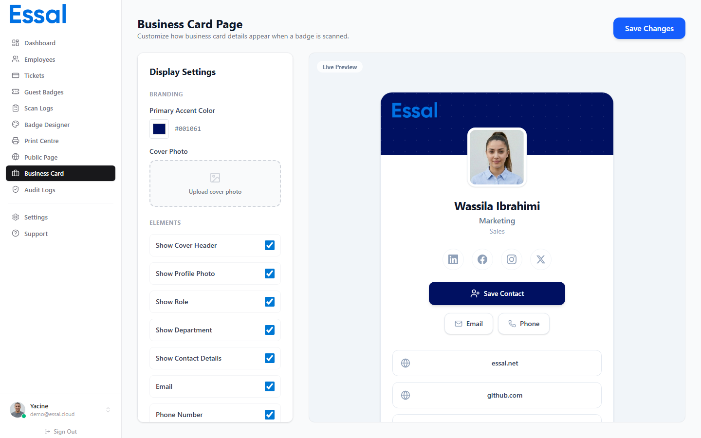

{/* category: Business Cards */}

Chaque employé dans Essal Access dispose d'une carte de visite numérique — une page claire et partageable affichant ses détails professionnels et ses coordonnées. La carte de visite est conçue pour être partagée comme une carte physique : via un lien, un code QR ou un fichier vCard qui peut être enregistré directement dans les contacts d'un téléphone.

---

## Carte de Visite vs Profil Public

Essal Access propose deux vues publiques différentes :

|                   | Carte de Visite                                        | Profil Public Complet                                                      |
| ----------------- | ------------------------------------------------------ | -------------------------------------------------------------------------- |
| **Objectif**      | Réseautage professionnel, partage de contact           | Vérification de badge et contrôle d'accès                                  |
| **Visible quand** | Toujours (quand le mode carte de visite est actif)     | Uniquement quand la vérification publique est d'activée                    |
| **Contient**      | Nom, rôle, département, contact, bio, liens            | Tout ce qui précède + tickets, zones d'accès, données de santé et sécurité |
| **Alternative**   | Affichée quand la vérification complète est désactivée | —                                                                          |

La carte de visite est la vue légère et respectueuse de la vie privée. Le profil public complet est la vue orientée vers le contrôle d'accès.

---

## Ce qui apparaît sur la carte

Une carte de visite affiche :

- **Bande de couverture** — la couleur primaire de votre organisation, avec une photo de couverture facultative et le logo de l'entreprise.
- **Photo de profil** — la photo de l'employé, ou ses initiales si aucune photo n'est définie.
- **Nom, rôle et département**.
- **Icônes de réseaux sociaux** — LinkedIn, Twitter/X, Instagram, Facebook (liés).
- **Bouton Enregistrer le Contact** — télécharge un fichier vCard (.vcf) pour enregistrement dans les contacts du téléphone.
- **Boutons E-mail et Appeler** — liens d'action rapide (si les coordonnées sont partagées).
- **Site web et liens personnalisés** — tout lien supplémentaire configuré par l'administrateur ou l'employé.
- **Bio** — le texte de biographie de l'employé.
- **Section Contact** — e-mail et téléphone avec icônes.

---

## Qui peut éditer la carte

- **Les administrateurs** configurent le modèle (couleurs, photo de couverture, champs affichés et liens à l'échelle de l'organisation) dans l'**Éditeur de Carte de Visite**.
- **Les employés** peuvent ajouter leurs propres liens personnalisés depuis le Portail Employé.

---

## Activer le Mode Carte de Visite

Pour rediriger tous les scans de badges vers la carte de visite au lieu du profil complet :

1. Allez dans **Paramètres → Général**.
2. Désactivez **Autoriser la vérification publique des badges**.
3. Activez **Mode carte de visite**.

Avec cette configuration, scanner n'importe quel badge d'employé affichera la carte de visite plutôt qu'un écran bloqué/restreint.
